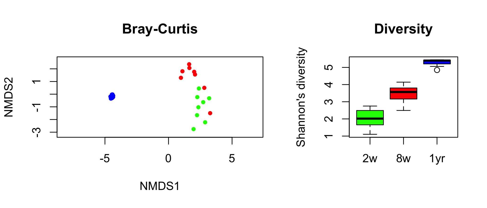

Updated December 19, 2017

Online version available at http://rpubs.com/dillmcfarlan/R_microbiotaSOP

#Tips for this workshop
1. If you have any issues in R, type ??command into the console where "command" is the function you are having issues with and a help page will come up. 
2. Lines starting with `#` are comments that are for the reader's benefit. These lines are not code and do not need to be entered into the console.
3. GREY boxes contain code that you can copy and paste to run on your machine.
```{r}
#GREY box
```
4. WHITE boxes contain sample output of this code, and nothing will happen if you try to copy it into your console.
```{}
WHITE box
``` 
5. Basic R code you may find useful:
    a. Matrices/data frames are designated by [ , ] where it is [rows, columns]
    b. | is or 
    c. & is and

#Introduction
Written for R v3.3.2 in RStudio v1.0.136

##Goal
The goal of this tutorial is to demonstrate basic analyses of microbiota data to determine if and how communities differ by variables of interest. In general, this pipeline can be used for any microbiota data set that has been clustered into operational taxonomic units (OTUs).

This tutorial assumes some basic statistical knowledge. Please consider if your data fit the assumptions of each test (normality? equal sampling? Etc.). If you are not familiar with statistics at this level, we strongly recommend collaborating with someone who is. The incorrect use of statistics is a pervasive and serious problem in the sciences so don't become part of the problem! That said, this is an introductory tutorial and there are many, many further analyses that can be done with microbiota data. Hopefully, this is just the start for your data!

##Data
The data used here were created using 2x250 bp amplicon sequencing of the bacterial V4 region of the 16S rRNA gene on the Illumina MiSeq platform. The full data set is in [Dill-McFarland *et al*. Sci Rep 7: 40864](https://www.ncbi.nlm.nih.gov/pubmed/28098248). Here, we will use a subset of samples. Specifically, we will be correlating the fecal bacterial microbiota of 8 dairy calves at different ages (2 weeks, 8 weeks, 1 year) to variables like weight gain (average daily gain in kg, ADGKG) and gastrointestinal short chain fatty acids (SCFA).

##Files
We will use the following files created using the [Microbiota Processing in mothur: Standard Operating Procedure (SOP)](https://rpubs.com/dillmcfarlan/mothurSOP).

* example.final.nn.unique_list.0.03.norm.shared (OTU table)
* example.final.nn.unique_list.0.03.cons.taxonomy (Taxonomy of OTUs)

We will also be using tab-delimited metadata and SCFA files created in Excel. The metadata includes our metadata (like age and ADGKG) as well as alpha-diversity metrics from `example.final.nn.unique_list.0.03.norm.groups.summary` calculated in mothur. The SCFA table is the mM concentrations of different SCFAs in rumen (stomach) liquids from 1-year-old animals.

* example.metadata.txt
* example.SCFA.txt

Finally, we will be loading a number of custom scripts from `Steinberger_scripts` and some a pre-calculated OTU tree `NJ.tree.RData`. The information for creating this tree is provided in this tutorial.

**All data can be downloaded from [GitHub](https://github.com/kdillmcfarland/workshops_UW_Madison)**

#Get set up
##Download and install
* Base R: http://cran.mtu.edu/
* RStudio: https://www.rstudio.com/products/rstudio/download3/
* Packages: Open RStudio on your computer. If you have not already downloaded these packages, go to the lower right quadrant of your screen and open the Package tab. Click "download" and search for the package you want to download.
    + `ape`
    + `dplyr`
    + `ggplot2`
    + `gplots`
    + `lme4`
    + `phangorn`
    + `plotly`
    + `tidyr`
    + `vegan`
    + `VennDiagram`
    + `phyloseq` (`phyloseq` is not on CRAN, so we have to call it manually. See below.)
  
Copy and paste the following into your console.
```{r}
source("https://bioconductor.org/biocLite.R")
biocLite("phyloseq")
```

**Note**: If you are having trouble installing packages, turn off your computer's firewall temporarily. 

##Organization
All of our analyses will be organized into a "Project".

Make a new project by selecting File->New project. Select "New Directory" and "Empty Project". Name the project "Microbiota_Analysis_BRC" and save the project to your Desktop. Place all of your files for this analysis in the folder created on the Desktop

Create a new R script (File->New file->R script) to save your code. This file will automatically be saved in the project folder.

Now your screen should look like this

* Upper left: Where you type and save the code you want to run.
* Upper right: Files you load into and create in R. To view one, click on it and it will open in the upper left pane.
* Lower left: The console. Where commands and outputs run (similar to the one mothur window).
* Lower right: Variable. Explore the different tabs.

#Data manipulation
##Load Packages
The "library" command tells R to open the package you want to use. You need to do this every time you open R.

```{r Load packages}
#Analyses of Phylogenetics and Evolution package. Required for tree calculations to be used with phyloseq
library(ape)

#This package will also help us more easily manipulate our data
library(dplyr)

#Graphing package used in phyloseq. To edit the default setting of a plot, you need to use functions in this package.
library(ggplot2)

#This package is used to calculate and plot Venn diagrams as well as heatmaps
library(gplots)

#Linear mixed-effects models like repeated measures analysis
library(lme4)

#used to read in mothur-formatted files
library(phangorn)

#The phyloseq package seeks to address issues with multiple microbiome analysis packages by providing a set of functions that internally manage the organizing, linking, storing, and analyzing of phylogenetic sequencing data. In general, this package is used for UniFrac analyses.
library(phyloseq)

#A package to create interactive web graphics of use in 3D plots
library(plotly)

#This package will help us more easily manipulate our data, which are matrices
library(tidyr)

#The vegan package provides tools for descriptive community ecology. It has most basic functions of diversity analysis, community ordination and dissimilarity analysis. In general, this package is used for Bray-Curtis and Jaccard analyses.
library(vegan)

#Pretty Venn disgrams
library(VennDiagram)
```

##Load Data
In the code, the text before = is what the file will be called in R. Make this short but unique as this is how you will tell R to use this file in later commands.

* header: tells R that the first row is column names, not data
* row.names: tells R that the first column is row names, not data
* sep: tells R that the data are tab-delimited. If you had a comma-delimited file, you would us `sep=","`

```{r Load data}
#OTU table (shared file)
OTU = read.table("Data/example.final.an.unique_list.0.03.norm.shared", header=TRUE, sep="\t")

#Taxonomy of each OTU
tax = read.table("Data/example.final.an.unique_list.0.03.cons.taxonomy", header=TRUE, sep="\t")

#Metadata. Since we made this in Excel, not mothur, we can use the "row.names" modifier to automatically name the rows by the values in the first column (sample names)
meta = read.table("Data/example.metadata.txt", header=TRUE, row.names=1, sep="\t")

#SCFA data
SCFA = read.table("Data/example.SCFA.txt", header=TRUE, row.names=1, sep="\t")
```

##Clean up the data
You can look at your data by clicking on it in the upper-right quadrant "Environment"

There are several unneeded columns and incorrect formatting in the tables as they were output by mothur. We will now fix them.

###OTU table
We need to use the "Group" column as the row names so that it will match our metadata
```{r}
row.names(OTU) = OTU$Group
```

We then need to remove the "label", "numOTUs", and "Group" columns as they are not OTU counts like the rest of the table
```{r}
OTU.clean = OTU[,-which(names(OTU) %in% c("label", "numOtus", "Group"))]
```

###Taxonomy table
For the taxonomy table, we name the rows by the OTU #
```{r}
row.names(tax) = tax$OTU
```

Remove all the OTUs that don't occur in our OTU.clean data set
```{r}
tax.clean = tax[row.names(tax) %in% colnames(OTU.clean),]
```

We then need to separate the "taxonomy" column so that each level (*i.e.* Domain, Phylum, etc) is in it's own column. We do this with a special command "separate" from the `tidyr` package
```{r}
tax.clean = separate(tax.clean, Taxonomy, into = c("Domain", "Phylum", "Class", "Order", "Family", "Genus", "Species", "Strain"), sep=";")
```

Finally, we remove the "Size" and "Strain" columns as well as "OTU" since these are now the row names
```{r}
tax.clean = tax.clean[,-which(names(tax.clean) %in% c("Size", "Strain", "OTU"))]
```

###Metadata and SCFA tables
These tables do not require any modification since I created them in Excel exactly as I need them for this R analysis. 

##Order the data
To make viewing and using the data easier, we will make sure our tables have samples (rows) in the same order. Since OTU.clean, meta, and SCFA have sample names as row names, we order by these.
```{r Order the data}
OTU.clean = OTU.clean[order(row.names(OTU.clean)),]
meta = meta[order(row.names(meta)),]
SCFA = SCFA[order(row.names(SCFA)),]
```

Our taxonomy table is already in order from OTU1 to OTUN so we do not need to order it. 

##Set seed
We will be running some processes that rely on the random number generater. To make your analysis reproducible, we set the random seed.

```{r}
set.seed(8765)
```

#Alpha-diversity
Alpha-diversity is within sample diversity. It is how many different species (OTUs) are in each sample (richness) and how evenly they are distributed (evenness), which together are diversity. Each sample has one value for each metric.


This image illustrates richness vs. diversity. Both forests have the same richness (4 tree species) but Community 1 has much more even distribution of the 4 species while Community 2 is dominated by tree species A. This makes Community 1 more diverse than Community 2.


##Explore alpha metrics
Now we will start to look at our data. We will first start with alpha-diversity and richness. Let's plot some common ones here.
```{r}
#Create 2x2 plot environment so that we can see all 4 metrics at once. 
par(mfrow = c(2, 2))

#Then plot each metric.
hist(meta$shannon, main="Shannon diversity", xlab="", breaks=10)
hist(meta$simpson, main="Simpson diversity", xlab="", breaks=10)
hist(meta$chao, main="Chao richness", xlab="", breaks=15)
hist(meta$ace, main="ACE richness", xlab="", breaks=15)
```

You want the data to be roughly normal so that you can run ANOVA or t-tests. If it is not normally distributed, you will need to consider non-parametric tests such as Kruskal-Wallis.

Here, we see that none of the data are normally distributed. This occurs with the subset but not the full data set because I've specifically selected samples with divergent alpha metrics. In general, you will see roughly normal data for Shannon's diversity as well as most richness metrics. Simpson's diversity, on the other hand, is usually skewed as seen here.

So most will use inverse Simpson (1/Simpson) instead. This not only increases normalcy but also makes the output more logical as a higher inverse Simpson value corresponds to higher diversity.

Let's look at inverse Simpson instead.
```{r}
#Create 2x2 plot environment 
par(mfrow = c(2, 2))

#Plots
hist(meta$shannon, main="Shannon diversity", xlab="", breaks=10)
hist(1/meta$simpson, main="Inverse Simpson diversity", xlab="", breaks=10)
hist(meta$chao, main="Chao richness", xlab="", breaks=15)
hist(meta$ace, main="ACE richness", xlab="", breaks=15)
```

Now we see a bimodal distribution for Simpson similar to the richness metrics.

To test for normalcy statistically, we can run the Shapiro-Wilk test of normality.
```{r}
shapiro.test(meta$shannon)
shapiro.test(1/meta$simpson)
shapiro.test(meta$chao)
shapiro.test(meta$ace)
```

We see that, as expected from the graphs, none are normal.

However, our sample size is small and normalcy tests are very sensitive for small data-sets. In fact, you can run Shapiro-Wilk on a list of 50 values randomly sampled from the R-generated normal distribution and find that they are not normal (even though we know that they are!)

So, what does this mean for our purposes? Well, we should run statistical tests that don't assume our data is normal, because we don't have any evidence (graphs, Shapiro-Wilk) that it is normal. For demonstration purposes, though, we will run other tests as well. 

Overall, for alpha-diversity:

* ANOVA, t-test, or general linear models with the normal distribution are used when the data is roughly normal
* Kruskal-Wallis, Wilcoxon rank sum test, or general linear models with another distribution are used when the data is not normal

Our main variables of interest are

* AgeGroup: 2w, 8w, 1yr
* ADGKG: 0.05-1.56 kg gained per day (average daily gain kg)

##Categorical variables
Now that we know which tests can be used, let's run them. 

**Normally distributed metrics**

Since it's the closest to normalcy, we will use **Shannon's diversity** as an example. First, we will test age, which is a categorical variable with more than 2 levels. Thus, we run ANOVA. If age were only two levels, we could run a t-test

Does age impact the Shannon diversity of the fecal microbiota?
```{r}
#Run the ANOVA and save it as an object
aov.shannon.age = aov(shannon ~ AgeGroup, data=meta)
#Call for the summary of that ANOVA, which will include P-values
summary(aov.shannon.age)
```

To do all the pairwise comparisons between groups and correct for multiple comparisons, we run Tukey's honest significance test of our ANOVA.
```{r}
TukeyHSD(aov.shannon.age)
```

We clearly see that all age groups have significantly different diversity. When we plot the data, we see that diversity increases as the animals age.
```{r}
#Re-order the groups because the default is 1yr-2w-8w
meta$AgeGroup.ord = factor(meta$AgeGroup, c("2w","8w","1yr"))
#Return the plot area to 1x1
par(mfrow = c(1, 1))
#Plot
boxplot(shannon ~ AgeGroup.ord, data=meta, ylab="Shannon's diversity")
```

**Non-normally distributed metrics**

We will use **Chao's richness estimate** here. Since age is categorical, we use Kruskal-Wallis (non-parametric equivalent of ANOVA). If we have only two levels, we would run Wilcoxon rank sum test (non-parametric equivalent of t-test)
```{r}
kruskal.test(chao ~ AgeGroup, data=meta)
```

We can test pairwise within the age groups with Wilcoxon Rank Sum Tests. This test has a slightly different syntax than our other tests
```{r}
pairwise.wilcox.test(meta$chao, meta$AgeGroup, p.adjust.method="fdr")
```

Like diversity, we see that richness also increases with age.
```{r}
#Create 1x1 plot environment
par(mfrow = c(1, 1))
#Plot
boxplot(chao ~ AgeGroup.ord, data=meta, ylab="Chao richness")
```

##Continuous variables
For continuous variables, we use general linear models, specifying the distribution that best fits our data.

**Normally distributed metrics**

Since ADG is a continuous variable, we run a general linear model. We will again use Shannon's diversity as our roughly normal metric. The default of `glm` and `lm` is the normal distribution so we don't have to specify anything.

Does ADG impact the Shannon diversity of the fecal microbiota?
```{r}
glm.shannon.ADG = glm(shannon ~ ADGKG, data=meta)
summary(glm.shannon.ADG)
```

The output let's us know that the intercept of our model is significantly different from 0 but our slope (*e.g.* our variable of interest) is not. This makes sense when we look at the data.
```{r}
plot(shannon ~ ADGKG, data=meta)
#Add the glm best fit line
abline(glm.shannon.ADG)
```

**Non-normally distributed metrics**

We will again use a general linear model for our non-normally distributed metric Chao. However, this time, we change the distribution from normal to something that fits the data better. 

But which distribution should we choose? In statistics, there is no one "best" model. There are only good and better models. We will use the plot() function to compare two models and pick the better one.

First, the Gaussian (normal) distribution, which we already know is a bad fit.
```{r}
gaussian.chao.ADG = glm(chao ~ ADGKG, data=meta, family="gaussian")
par(mfrow = c(1,2))
plot(gaussian.chao.ADG, which=c(1,2))
```

Quasipoisson (log) distribution
```{r}
qp.chao.ADG = glm(chao ~ ADGKG, data=meta, family="quasipoisson")
par(mfrow = c(1,2))
plot(qp.chao.ADG, which=c(1,2))
```

What we're looking for is no pattern in the Residuals vs. Fitted graph ("stars in the sky"), which shows that we picked a good distribution family to fit our data. We also want our residuals to be normally distributed, which is shown by most/all of the points falling on the line in the Normal Q-Q plot.

While it's still not perfect, the quasipoisson fits much better with residuals on the order of 30 whereas gaussian was on the order of 600. So, we will use quasipoisson and see that ADG does not to correlate to Chao richness.
```{r}
summary(qp.chao.ADG)
```

Plotting this we see that, indeed, there is not signficant correlation between Chao and ADG.
```{r}
#Return the plot area to 1x1
par(mfrow = c(1, 1))
#Plot
plot(log(chao) ~ ADGKG, data=meta, ylab="ln(Chao's richness)")
abline(qp.chao.ADG)
```

##Mixed models
Our two variables may not be fully independent and therefore, running them in two separate tests may not be correct. That is to say, age may impact ADG. In fact, I know this is the case because calves (2w, 8w) gain weight more quickly than heifers (1yr).

Think about your variables and what they mean "in the real world." Logically combine them into as few ANOVA tests as possible. In the end, it's better to test a meaningless interaction than not test a meaningful one.

We can test if the interaction of age and ADG impacts diversity with a model that includes both of our variables. The `*` symbol is a shortcut for models. A*B is equivalent to A + B + A:B
```{r}
aov.shannon.all = aov(shannon ~ AgeGroup*ADGKG, data=meta)
summary(aov.shannon.all)
```

We can see that the interaction of age and ADG doesn't significantly impact Shannon diversity, So we should remove that variable to simplify our model. If you had many interaction terms, you would step-wise remove the one with the highest P-value until you had the simplest model with only individual variables and significant interaction terms.
```{r}
aov.shannon.all2 = aov(shannon ~ AgeGroup+ADGKG, data=meta)
summary(aov.shannon.all2)
```

Overall, the ANOVA test tells us that only age impacts Shannon diversity but it does not tell us which age groups differ from one another. If all of our variables were categorical, we could run TukeyHSD like we did with age only. 
```{r}
TukeyHSD(aov.shannon.all)
```

However, you will see that we don't get any data from ADG since it is continuous. There is an error denoting this as "non-factors ignored: ADGKG"

So, we should have run our test as a glm since we have at least one continuous variable. First, we will still include the interaction variable to see that type of output.
```{r}
glm.shannon.all = glm(shannon ~ AgeGroup*ADGKG, data=meta)
summary(glm.shannon.all)
```

Now this output is saying the same thing as ANOVA but in a more complicated way. The function automatically picks a reference group for categorical variables (in this case, 1yr) to compare all other groups to. Let's go through each line

* (Intercept) - This is whether or not the y-intercept is 0. A significant P-value indicates that the intercept is not 0, and we wouldn't expect it to be for any alpha-diversity metric since 0 means nothing is there

* AgeGroup2w - the difference between Shannon when Age = 2w vs. 1yr (the same as testing "shannon ~ AgeGroup" and only looking at the 2w-1yr pairwise comparison)
* AgeGroup8w - the same as 2w but now looking at only the 8w-1yr comparison

* ADGKG - the slope of Shannon to ADGKG (the same as testing "shannon ~ ADGKG")

* AgeGroup2w:ADGKG - the difference in slope of shannon ~ ADG between ages 2w and 1yr
* AgeGroup8w:ADGKG - the difference in slope of shannon ~ ADG between ages 8w and 1yr

As we saw in ANOVA, none of the interaction terms are significant so we remove them.
```{r}
glm.shannon.all2 = glm(shannon ~ AgeGroup+ADGKG, data=meta)
summary(glm.shannon.all2)
```

**Note**: The full glm model with the interaction term included did not show age as significant. When we remove the interaction term, age is significant. This is why you should remove non-significant interactions terms as they can the mask main effects of individual variables.

We can run a similar test with non-normal data like Chao. 
```{r}
qp.chao.all = glm(chao ~ AgeGroup*ADGKG, data=meta, family="quasipoisson")
summary(qp.chao.all)
```

Remove the non-significant interaction.
```{r}
qp.chao.all2 = glm(chao ~ AgeGroup+ADGKG, data=meta, family="quasipoisson")
summary(qp.chao.all2)
```

##Repeated measure
Another thing to consider with this data is the fact that we sampled the same animals over time. So, we have a repeated measures design. There are a number of ways to do repeated measures in R. I personally like the `lme4` package used here.

We add the repeated measure component by adding a random effect for the individual animals with `(1|Animal)` in the `lmer` function.
```{r}
rm.shannon.all = lmer(shannon ~ AgeGroup+ADGKG + (1|Animal), data=meta)
summary(rm.shannon.all)
```

We see that very little of the variance in the data is explained by the animal random effects (0.03793). So we actually don't need to include repeated measures in our final model, but it was necessary to check!
 
 
**From all of this, we can conclude that the fecal microbiota increases in diversity and richness as dairy cows age. Animal growth as measured by ADG does not correlate with fecal community diversity or richness.**


#Beta-diversity
Beta-diversity is between sample diversity. It is how different every sample is from every other sample. Thus, each sample has more than one value. Some metrics take abundance into account (*i.e.* diversity: Bray-Curtis, weighted UniFrac) and some only calculate based on presence-absence (*i.e.* richness: Jaccard, unweighted UniFrac).

Beta-diversity appears like the following (completely made-up numbers)

   .    | sample1 | sample2 | sample3 | ...
------- | ------- | ------- | ------- | ---
sample1 |    0    |  0.345  |  0.194  | ...
sample2 |  0.345  |    0    |  0.987  | ...
sample3 |  0.194  |  0.987  |    0    | ...
  ...   |   ...   |   ...   |   ...   | ...
  
##Visualization
The best way to visualize beta-diversity, or how different samples are from each other, is by non-metric multidimensional scaling (nMDS). This is similar to principle coordinate analysis or PCA/PCoA if you've heard of that, only nMDS is more statistically robust with multiple iterations in the form of the `trymax` part of the command.

Each symbol on an nMDS plot represents the total microbial community of that sample. Symbols closer together have more similar microbiotas while those farther apart have less similar.

###OTU-based metrics
There are two main type of beta-diversity measures. These OTU-based metrics treat every OTU as a separate entity without taking taxonomy into account. The distance between *Prevotella* OTU1 and *Prevotella* OTU2 is equivalent to the distance between *Prevotella* OTU1 and *Bacteroides* OTU1.

####Dot plots
First, we calculate the nMDS values for a 2-axis `k=2` graph using the OTU-based Bray-Curtis metric that takes into account both the presence/absence and abundance of OTUs in your samples (*i.e.* diversity). This uses the `metaMDS` function from the package `vegan`.
```{r}
BC.nmds = metaMDS(OTU.clean, distance="bray", k=2, trymax=1000)
```

We see that we reached a convergent solution around 20 iterations and our stress is very low (0.06), meaning that 2-axis are sufficient to view the data.

Then plot the nMDS with different colors for your different groups of interest. We will use colors for our three ages
```{r}
par(mfrow = c(1, 1))
#Create a blank plot for the nmds
plot(BC.nmds, type="n", main="Bray-Curtis")
#Add the points colored by age
points(BC.nmds, display="sites", pch=20, col=c("blue", "green", "red")[meta$AgeGroup])
#Add a legend
legend(-5.5, 2.5, legend=c("2w","8w","1yr"), col=c("green","red","blue"), pch=20)
```

This will create a plot in the lower right quadrant. If you want to get fancy, type "?plot" in the console to see other ways to modify the plot function.

A similar thing can be done for the Jaccard metric, which only takes into account presence/absence (*i.e.* richness).
```{r}
J.nmds = metaMDS(OTU.clean, distance="jaccard", k=2, trymax=1000)

plot(J.nmds, type="n", main="Jaccard")
points(J.nmds, display="sites", pch=20, col=c("blue", "green", "red")[meta$AgeGroup])
legend(-3, 1.5, legend=c("2w","8w","1yr"), col=c("green","red","blue"), pch=20)
```

You see that the values are very different for Jaccard but the pattern of points is very similar to Bray-Curtis. This is because Jaccard is a transformation of Bray-Curtis with J = 2BC/(1+BC)

####Ellipses
You can also plot standard error (se) ellipses for your nmds data instead of showing all of the individual points. Here, we will plot 99% confidence se ellipses for the Bray-Curtis metric using `ordiellipse` from `vegan`.

Code courtesy of Madison Cox.
```{r}
plot(BC.nmds, type="n", main="Bray-Curtis")
legend(-5.5, 2.5, legend=c("2w","8w","1yr"), col=c("green","red","blue"), pch=20)

#Add an ellipse for 2w
ordiellipse(BC.nmds, groups=meta$AgeGroup, display="sites", kind="se", conf=0.99, label=FALSE, col="green", draw="polygon", alpha=200, show.groups = c("2w"), border=FALSE)

#Add an ellipse for 8w
ordiellipse(BC.nmds, groups=meta$AgeGroup, display="sites", kind="se", conf=0.99, label=FALSE, col="red", draw="polygon", alpha=200, show.groups = c("8w"), border=FALSE)

#Add an ellipse for 1yr
ordiellipse(BC.nmds, groups=meta$AgeGroup, display="sites", kind="se", conf=0.99, label=FALSE, col="blue", draw="polygon", alpha=200, show.groups = c("1yr"), border=FALSE)
```

We clearly see in both the dot and ellipse plots that age significantly impacts the overall structure (Bray-Curtis) and composition (Jaccard) of the fecal bacterial microbiota.

####3D plots
If your stress is high (like over 0.3) for your `metaMDS` calculation, you probably need to increase to 3 axes `k=3`. Graphing a 3D plot is much more complicated, and there are a number of packages that could be used. Here, we will use one option from the `plotly` package to visualize a 3D Bray-Curtis plot.

```{r}
#Calculate the Bray-Curtis nMDS for 3-axis
BC.nmds.3D = metaMDS(OTU.clean, distance="bray", k=3, trymax=1000)
```

Extract x-y-z values for this nmds
```{r}
BCxyz = scores(BC.nmds.3D, display="sites")
#This is a table that looks like 
BCxyz
```

Plot the xyz coordinates and color by age
```{r}
plot_ly(x=BCxyz[,1], y=BCxyz[,2], z=BCxyz[,3], type="scatter3d", mode="markers", color=meta$AgeGroup, colors=c("blue", "green", "red"))
```

**Note**: Since 3D plots are difficult to interpret in printed journal articles, many authors choose to create two separate 2D plots to show the 3D data like so.
```{r}
par(mfrow=c(1,2))
#Axis 1 and 2 (x and y)
plot(BCxyz[,1], BCxyz[,2], main="Bray-Curtis 1:2", pch=20, col=c("blue", "green", "red")[meta$AgeGroup])
legend(-5.4, 3, legend=c("2w","8w","1yr"), col=c("green","red","blue"), pch=20)
#Axis 1 and 3 (x and z)
plot(BCxyz[,1], BCxyz[,3], main="Bray-Curtis 1:3", pch=20, col=c("blue", "green", "red")[meta$AgeGroup])
```

###Phylogentic-based metrics
The most common of this type of beta-diversity metrics is UniFrac. The strength of UniFrac over Bray-Curtis or Jaccard is that it takes into account phylogenetic relationships of the species present in the microbiota. Thus, samples with different OTUs from the same genus will be more similar by UniFrac that those with OTUs from different genera. The weakness is that UniFrac is more sensitive to low abundance OTUs and those that a very phylogenetically distant. 

Your choice will depend on how much you personally feel phylogenetic relationships vs. sensitively matter in your data.

Just as above, UniFrac can be plotted as an nMDS. You just need to use a different R package, and thus, slightly different commands. 

####Create physeq object
To start, you must make a `phyloseq` object which includes the OTU.clean, meta, and tax.clean data. We tell R which tables are each type
```{r nMDS_unifrac}
OTU.UF = otu_table(as.matrix(OTU.clean), taxa_are_rows=FALSE)
tax.UF = tax_table(as.matrix(tax.clean))
meta.UF = sample_data(meta)
```

We then merge these into an object of class phyloseq.
```{r}
physeq = phyloseq(OTU.UF, tax.UF, meta.UF)
```

To add the phylogenetic component to UniFrac, we calculate a rooted phylogenetic tree of our OTUs. This takes a long time so we have provided the tree for you. 

However, if we were to calculate a tree, first, we import a distance matrix created from representative sequences of our OTUs. We would use `phangorn` to read the file as it was created in mothur as seen under "Trees of OTUs" [here](https://rpubs.com/dillmcfarlan/mothurSOP). 

**DO NOT RUN THIS**
```{}
dist.mat = import_mothur_dist("clean_repFasta.phylip.dist")
```

We would then calculate a rooted neighbor-joining tree from the distance matrix using the `ape` package.

**DO NOT RUN THIS**
```{}
NJ.tree = bionj(dist.mat)
```

Instead, we have pre-calculated this tree and you can load is with
```{r}
load("Data/NJ.tree.Rdata")
```

Then, add this tree to your physeq object. This object will be what is used in UniFrac calculations.
```{r}
physeq.tree = merge_phyloseq(physeq, NJ.tree)
```

We can look at this object and see its components.
```{r}
physeq.tree
```

####Dot plots
Calculate weighted UniFrac (*i.e.* diversity) distances and ordinate into an nMDS. We specify weighted with `weighted=TRUE`.
```{r}
wUF.ordu = ordinate(physeq.tree, method="NMDS", distance="unifrac", weighted=TRUE)
```

You can plot UniFrac nMDS using the basic `plot` function as we've done before.
```{r}
par(mfrow=c(1,1))
plot(wUF.ordu, type="n", main="Weighted UniFrac")
points(wUF.ordu, pch=20, display="sites", col=c("blue", "green", "red")[meta$AgeGroup])
legend(0.3,0.15, legend=c("2w","8w","1yr"), col=c("green","red","blue"), pch=20)
```

But let's also look at the `ggplot2` package. This package is incredibly powerful and can be customized in many ways. [This document](https://www.rstudio.com/wp-content/uploads/2016/11/ggplot2-cheatsheet-2.1.pdf) has many helpful tips.
```{r}
plot_ordination(physeq.tree, wUF.ordu, type="sites", color="AgeGroup") + 
  scale_colour_manual(values=c("2w"="green", "8w"="red", "1yr"="blue")) + 
  theme_bw() + 
  ggtitle("Weighted UniFrac")
```

Unweighted UniFrac (*i.e.* richness) can be visualized in the same way. We specify unweighted with `weighted=FALSE`.
```{r}
uwUF.ordu = ordinate(physeq.tree, method="NMDS", distance="unifrac", weighted=FALSE)

plot_ordination(physeq.tree, uwUF.ordu, type="sites", color="AgeGroup") + 
  scale_colour_manual(values=c("2w"="green", "8w"="red", "1yr"="blue")) + 
  theme_bw() + 
  ggtitle("Unweighted UniFrac")
```

####Ellipses
Ellipses can be plotted instead of points as well. With the basic plot function:
```{r}
plot(wUF.ordu, type="n", main="Weighted UniFrac")
legend(0.3, 0.15, legend=c("2w","8w","1yr"), col=c("green","red","blue"), pch=20)

#Add an ellipse for 2w
ordiellipse(wUF.ordu, groups=meta$AgeGroup, display="sites", kind="se", conf=0.99, label=FALSE, col="green", draw="polygon", alpha=200, show.groups = c("2w"), border=FALSE)

#Add an ellipse for 8w
ordiellipse(wUF.ordu, groups=meta$AgeGroup, display="sites", kind="se", conf=0.99, label=FALSE, col="red", draw="polygon", alpha=200, show.groups = c("8w"), border=FALSE)

#Add an ellipse for 1yr
ordiellipse(wUF.ordu, groups=meta$AgeGroup, display="sites", kind="se", conf=0.99, label=FALSE, col="blue", draw="polygon", alpha=200, show.groups = c("1yr"), border=FALSE)
```

We can also plot ellipses in `ggplot2`. However, these ellipses are not the exact same at the standard error ellipses used with OTU-based metrics as they use different underlying calculations. However, they get at the same question of confidence intervals for groups of points on an nMDS.

We plot ellipses with `ggplot2` by adding the `stat_ellipse` function to our plot.
```{r}
plot_ordination(physeq.tree, wUF.ordu, type="sites", color="AgeGroup") + 
  scale_colour_manual(values=c("2w"="green", "8w"="red", "1yr"="blue")) + 
  theme_bw() + 
  stat_ellipse() + 
  ggtitle("Weighted UniFrac")
```

####3D plots
3D UniFrac ordinations are not currently supported by `phyloseq`. We see that our ordinations only include 2 dimensions.
```{r}
wUF.ordu
```

But we can instead calculate UniFrac distances using `UniFrac` and ordinating for 3-axes with `metaMDS`.

```{r}
wUF.dist = UniFrac(physeq.tree, weighted=TRUE, normalized=TRUE)
wUF.nmds.3D = metaMDS(wUF.dist, method="NMDS", k=3)
```

Then, similar to what we did with Bray-Curtis/Jaccard, we pull out the xyz values and plot with `plotly`.
```{r}
wUFxyz = scores(wUF.nmds.3D, display="sites")
#This is a table that looks like 
wUFxyz

plot_ly(x=wUFxyz[,1], y=wUFxyz[,2], z=wUFxyz[,3], type="scatter3d", mode="markers", color=meta$AgeGroup, colors=c("blue", "green", "red"))
```

###Vectors for continuous variables
While it is easy to visualize categorical groups with coloring in nMDS, it is difficult to achieve the same effect with continuous variables. Instead, we can fit these variables as a vector on our nMDS plots.

To do this, we first fit the variables to our distances using the `envfit` function in `vegan`. You can do Bray-Curtis, Jaccard, weighted or unweighted UniFrac. Here, we will demonstrate with Bray-Curtis and weighted UniFrac.
```{r nMDS_vectors}
fit.BC = envfit(BC.nmds, meta) 
fit.BC
```
We see that it has automatically fit every variable in our meta table.

The simplest way around this is to just ask envfit to run on only the variables you want.
```{r}
fit.BC = envfit(BC.nmds, meta[,c("AgeGroup", "ADGKG")])
fit.BC
```

We repeat for weighted UniFrac
```{r}
fit.wUF = envfit(wUF.ordu, meta[,c("AgeGroup", "ADGKG")])
fit.wUF
```
For categorical variables, envfit will label the centroid of the data for each group in the nMDS with that group's name. For continuous variables, it adds an arrow in the direction from smallest to largest value. 

**Note**: The P-values for variables in `envfit` are not equivalent to the P-values for our ANOVA/Kruskal/GLM tests. Instead, `envfit` P-values tell you how well the arrow or centroids fit the *x-y data of the nMDS*, not the underlying distance matrix. In general, if your nMDS is a good representation of the data (low stress value) and the variable was significant in its appropriate ANOVA/Kruskal/GLM test, the fitted arrow/centroids will also be significant. And if your nMDS is a good representation of the data and the variable was *not* significant, the fitted arrow/centroids will also *not* be significant. We see this type of result here, but this will not always be the case.

However, if your nMDS stress was borderline or not great and/or your variable was borderline significant or not, you may see divergent results for the arrow/centroid. This does not mean that the result you got in ANOVA/Kruskal/GLM was invalid. It just means that it's difficult to visualize this result as a simple arrow or centroids on a 2D plot. Regardless, non-significant variables in `envfit` that you know are signficant in other tests may still be represented on an nMDS as a visual aid.

Thus, we plot our 2D nMDS colored by age with an arrow for the ADG variable even though that arrow was not significant. Since the ADG variable was also not significant in GLM, we probably won't use these plot in a publication, but it is good practice.

For Bray-Curtis:
```{r}
plot(BC.nmds, type="n", main="Bray-Curtis")
points(BC.nmds, pch=20, display="sites", col=c("blue", "green", "red")[meta$AgeGroup])
legend(-6, 2, legend=c("2w","8w","1yr"), col=c("green","red","blue"), pch=20)
#Add fitted variables
plot(fit.BC, col="black")
```

You could also ask it to only plot variables with a fit P-value < 0.05. So we would only see the centroids
```{r}
plot(BC.nmds, type="n", main="Bray-Curtis")
points(BC.nmds, pch=20, display="sites", col=c("blue", "green", "red")[meta$AgeGroup])
legend(-6, 2, legend=c("2w","8w","1yr"), col=c("green","red","blue"), pch=20)
#Add fitted variables
plot(fit.BC, col="black", p.max=0.05)
```

Weighted UniFrac
```{r}
plot(wUF.ordu, type="n", main="Weighted UniFrac")
points(wUF.ordu, pch=20, display="sites", col=c("blue", "green", "red")[meta$AgeGroup])
legend(.3,.15, legend=c("2w","8w","1yr"), col=c("green","red","blue"), pch=20)
#Add fitted variables
plot(fit.wUF, col="black")
```

You could also fit your OTU.clean table to the nMDS to add arrow(s) for specific OTUs within the plot. OTU arrows that, say, go in the same direction as an age group centroid tend to increase in abundance in that age group. The opposite direction would indicate that an OTU decreases in abundance in that age group.

Fitting all OTUs would take awhile so we will only fit the first 10 in our table.
```{r}
fit.BC.OTU = envfit(BC.nmds, OTU.clean[,1:10])
fit.BC.OTU

#We will only plot significant arrows in this case
plot(BC.nmds, type="n", main="Bray-Curtis")
points(BC.nmds, pch=20, display="sites", col=c("blue", "green", "red")[meta$AgeGroup])
legend(-6, -1.1, legend=c("2w","8w","1yr"), col=c("green","red","blue"), pch=20)
#Add fitted variables
plot(fit.BC.OTU, col="black", p.max=0.05)
```

You could also think about plotting higher taxonomic levels like summed genera or family groups of OTUs.
```{r}
#Extract all OTUs within the genus Ruminococcus
OTU.Rumino = OTU.clean[,tax.clean$Genus == "g__Ruminococcus"]
#Sum the abundances of the Ruminococcaceae OTUs into one variable (column)
OTU.Rumino$Rumino.sum = rowSums(OTU.Rumino)

#Fit the new Ruminococcaceae group
fit.BC.Rumino = envfit(BC.nmds, OTU.Rumino$Rumino.sum)
fit.BC.Rumino

#Plot
plot(BC.nmds, type="n", main="Bray-Curtis")
points(BC.nmds, pch=20, display="sites", col=c("blue", "green", "red")[meta$AgeGroup])
legend(-6, -1.1, legend=c("2w","8w","1yr"), col=c("green","red","blue"), pch=20)
#Add fitted variables
plot(fit.BC.Rumino, col="black", labels=c("Ruminococcus"))
```

##Statistically test beta-diversity
While nMDS gives us a visual of beta-diversity, it does not test for statistical differences. We do this with permutational analysis of variance (PERMANOVA) or analysis of similarity (ANOSIM). These test whether the overall microbial community differs by your variable of interest.

You can run them with Bray-Curtis, Jaccard, weighted or unweighted UniFrac to answer different questions. For example, if your variable is significant for Bray-Curtis/weighted UniFrac but not Jaccard/unweighted UniFrac, this means your groups tend to have the same OTUs (richness) but different abundances of those OTUs (diversity). When variables are signficant for Bray-Curtis/Jaccard but not UniFrac, this indicates that your samples have different specific OTUs but similar taxa. Like group 1 has a lot of *Prevotella* OTU1 and group 2 has a lot of *Prevotella* OTU2, but they are both *Prevotella* so UniFrac treats them as being very similar.

###PERMANOVA
For Bray-Curtis or Jaccard, we use the `vegan` package to calculate distances and run PERMANOVA. As with ANOVA/glm of alpha-diversity, we want to include all variables that could interact in one model.

**Note**: adonis cannot handle or account for NA or blanks in your data. Subset to only samples with complete metadata before running `vegdist` if these exist.
```{r}
#Calculate distance and save as a matrix
BC.dist=vegdist(OTU.clean, distance="bray")
#Run PERMANOVA on distances.
adonis(BC.dist ~ AgeGroup*ADGKG, data = meta, permutations = 1000)
```

Similarly for Jaccard
```{r}
J.dist=vegdist(OTU.clean, distance="jaccard")
adonis(J.dist ~ AgeGroup*ADGKG, data = meta, permutations = 1000)
```
We see that the interaction is not significant so we remove it. 
```{r}
adonis(BC.dist ~ AgeGroup+ADGKG, data = meta, permutations = 1000)
adonis(J.dist ~ AgeGroup+ADGKG, data = meta, permutations = 1000)
```


For UniFrac, we use the `phyloseq` package to calculate distances and then `vegan` to run PERMANOVA.
```{r}
wUF.dist = UniFrac(physeq.tree, weighted=TRUE, normalized=TRUE)
adonis(wUF.dist ~ AgeGroup*ADGKG, data=meta, permutations = 1000)

uwUF.dist = UniFrac(physeq.tree, weighted=FALSE, normalized=TRUE)
adonis(uwUF.dist ~ AgeGroup*ADGKG, data=meta, permutations = 1000)
```
Remove non-significant interaction term
```{r}
adonis(wUF.dist ~ AgeGroup+ADGKG, data=meta, permutations = 1000)
adonis(uwUF.dist ~ AgeGroup+ADGKG, data=meta, permutations = 1000)
```

###ANOSIM
If you have very different group sizes, you may consider analysis of similarities (ANOSIM) instead of PERMANOVA. This test does not assume equal group variances. However, it only allows simple 1 variable models with no interactions and can only be used for categorical (AgeGroup), not continuous (ADG) variables. So, ANOSIM has a lot of limitations and should only be used if you group sizes are *very, very* different, like 10 vs 100.

For example, Bray-Curtis:
```{r}
anosim(BC.dist, meta$AgeGroup, permutations = 1000)
```

**Overall, from the nMDS of various beta-diversity metrics (OTU- and phylogenetic-based) and statistical analyses, it is clear that age significantly impacts the fecal microbiota of dairy cows.**

###2D variables
These analyses are for comparing the microbiota to metadata that cannot fit in a single column and therefore, must be represented as a matrix of its own. For example, PERMANOVA can only tell you that the microbiota differs according to a single short chain fatty acid (SCFA), but other tests can tell you that the microbiota differs according to the overall SCFA profile. This section is also useful for comparing data if you have multiple OTU tables, like for bacteria, archaea, and fungi.

`Mantel` from `vegan` tests if two distance matrices co-vary *e.g.* does the data in matrix 1 change in the same way as the data in matrix 2. Like PERMANOVA, this test only tells you that the overall data co-vary, not which specific OTUs or SCFAs matter.

You can only compare samples were you have both types of data so we must subset our OTU table to only the samples that we also have SCFA for. The names are a little different between the tables so we also add ".F" to the SCFA names to make them match
```{r}
OTU.SCFA = OTU.clean[row.names(OTU.clean) %in% paste(row.names(SCFA), ".F", sep=""),]
```

We then calculate distance matrices separately for each matrix. It is not necessary to do Bray-Curtis, Jaccard and UniFrac here since our SCFA data does not have any taxonomy to it.
```{r}
dist1 = vegdist(OTU.SCFA)
dist2 = vegdist(SCFA)
```

Run a Mantel test comparing the 2 matrices.
```{r}
mantel(dist1, dist2, permutations=100)
```

We see that the overall OTU table and SCFA tables do not co-vary.

You can also run Mantel on 3 matrices at once like so

**Do not run as we do not have 3 matrices here**
```{}
mantel.partial(dist1, dist2, dist3, permutations=100)
```

##Beta dispersion
Sometimes it will be clear from nMDS that one group tends to vary more (be more spread out) than another group. You can test this statistically with multivariate homogeneity of group dispersion (variances). 

Here is an example for Bray-Curtis. We use the same distance matrix we calculated for PERMANOVA/ANOSIM

Calculate dispersion (variances) within each group.
```{r}
disp.age = betadisper(BC.dist, meta$AgeGroup)
```

Perform an ANOVA-like test to determine if the variances differ by groups.
```{r}
permutest(disp.age, pairwise=TRUE, permutations=1000)
```

Combining this with our plot,
```{r}
plot(BC.nmds, type="n", main="Bray-Curtis")
legend(.6,-2, legend=c("2w","8w","1yr"), col=c("green","red","blue"), pch=20)
ordiellipse(BC.nmds, groups=meta$AgeGroup, display="sites", kind="se", conf=0.99, label=FALSE, col="green", draw="polygon", alpha=200, show.groups = c("2w"), border=FALSE)
ordiellipse(BC.nmds, groups=meta$AgeGroup, display="sites", kind="se", conf=0.99, label=FALSE, col="red", draw="polygon", alpha=200, show.groups = c("8w"), border=FALSE)
ordiellipse(BC.nmds, groups=meta$AgeGroup, display="sites", kind="se", conf=0.99, label=FALSE, col="blue", draw="polygon", alpha=200, show.groups = c("1yr"), border=FALSE)
```

we see that 2 week and 8 week calves have similar variability in their fecal microbiotas but that both 2- and 8-week calves have more variable fecal microbiotas than 1-year heifers. 


#OTUs that differ by
##Categorical variables
Just because the overall microbiota does or does not differ between age groups, does not mean specific OTUs do or don't differ by age. However, it is inadvisable to just test all OTUs in your data set against all variables of interest. Since you are running multiple similar tests, you need to apply a false discovery rate (fdr) correctios and correcting across all OTUs (5002 in this data set) will most likely result in no significant results after fdr correction. Also, you don't want to look at over 5000 P-values, do you?

There are a number of way to decrease the number of OTUs you're looking at 

1. Don't use OTUs. Add together genus or family groups and test if all or some of these taxa differ across variables of interest
2. Apply an abundance cutoff such as only looking at OTUs/taxa that are at least 1% abundance in at least one sample
3. Apply a frequency cutoff such as only looking at OTUs/taxa that occur in at least 50% of samples
4. Combine 2 and 3

However, some of these methods are somewhat arbitrary. How do you pick an abundance or frequency cutoff? What if a low abundant OTU is of interest? And what if you are interested in possible species-level differences (OTUs) so high taxonomic levels aren't useful?

So, one way to non-arbitrarily select OTUs/taxa of interest is similarity percentages (SIMPER). SIMPER identifies the OTUs that most contribute to beta-diversity measures. These OTUs are the most abundant and/or most variable OTUs in the data set. **Note**: SIMPER outputs all pairwise comparisons (A-B, B-C, A-C, etc.) and thus, only works for categorical variables. 

SIMPER's output is a list of OTUs which cumulatively explain 70%+ of the variation between each comparison. The numbers below the OTUs are **cumulative**, so to get each OTU's contribution, you must subtract the previous OTU's value.

For example
```{r ID_OTUs_differ}
simper(OTU.clean, meta$AgeGroup, permutations=100)
```

We see a number of OTUs that may differ between 1 or more age comparisons. However, these are just the OTUs that most contribute to Bray-Curtis measures between our age groups. *They are not necessarily significantly different.*

To test significance, we compare the relative abundance of an OTU across our age groups with Kruskal-Wallis (OTU abundance is never normally distributed, trust me). For example, OTU1 occurs in all SIMPER age comparisons and does, in fact, significantly differ by age.
```{r}
kruskal.test(OTU.clean$Otu00001 ~ meta$AgeGroup)
```

In contrast, OTU17 occurs in SIMPER but does not actually significantly differ by age group
```{r}
kruskal.test(OTU.clean$Otu00017 ~ meta$AgeGroup)
```
**Note**: These P-values have not been corrected from false discovery rate (fdr) yet.

Now, it would be very tedious to individually test every variable of interest in SIMPER and then test every SIMPER OTU in Kruskal-Wallis. So, Andrew Steinberger (Suen lab) has written two scripts to simplify both SIMPER and Kruskal-Wallis of SIMPER OTUs. The latest versions can be found on his [GitHub page](https://github.com/asteinberger9/seq_scripts) and we have provided them for this workshop in `/Steinberger_scripts`

**Disclaimer** *Andrew has provided these scripts out of the goodness of his heart and provides no guarentee that they will work for your exact data set or with new versions of R/RStudio/vegan. You may contact him through GitHub with issues or errors, but it is not his job to troubleshoot for you. He may or may not address your concerns in an updated version of the scripts at a later time.*

The use of these scripts are as follows (from Steinberger GitHub with some modifications)

**simper_pretty.R**

This script is meant to rapidly perform the SIMPER function from the R package `vegan` for all comparisons of interest in a data set. Inputs are OTU and metadata tables, and the output is a .csv. User can tailor contents of .csv by setting perc_cutoff, low_cutoff, and low_val. This function can also handle taxonomic levels instead of OTU, but currently only select formats are compatible. Requires installation of the R package 'vegan'.

Usage: 

simper.pretty(x, metrics, c('interesting'), perc_cutoff=0.5, low_cutoff = 'y', low_val=0.01, 'output_name')

Inputs:

* x: OTU table
* metrics: metadata table
* interesting: a list of the column headers for the columns of interest in the metrics file. e.g. c('int1','int2','int3')
* perc_cutoff: % cutoff for output OTUs, as decimal (i.e. write 50% as 0.5), larger % increases number OTUs in output.
* low_cutoff: 'y' if want to REMOVE OTUs that contribute less than 1%
* low_val: set value of low cutoff (0.01), ignored if low_cutoff='n'.
* output_name: the name that is appended to the output filename "_clean_simper.csv".


**R_krusk.R**

This script takes the output .csv of `simper_pretty.R`, and the OTU/metadata/taxonomy tables, and performs the non-parametric Kruskal-Wallis rank-sum test on each OTU in the .csv file. Output is a .csv file containing the same contents of simper.pretty output with the following info: p-value, fdr corrected p-value, OTU taxonomic classification (if applicable), mean rel. abund and std dev of otu/tax_lvl in group 1 of comparison, and mean rel. abund and std dev of otu/tax_lvl in group 2 of comparison. Requires installation of R packages 'vegan' and 'dplyr'.

Usage:

kruskal.pretty(x, metrics, csv, c('interesting'), 'output_name', taxonomy)

Inputs:

* x: OTU table
* metrics: metadata table
* csv: output from simper.pretty, must be imported as data.frame. e.g. csv= data.frame(read.csv("PATH to name_clean_simper.csv"))
* interesting: a list of the column headers for the columns of interest in the metrics file, should be same as simper.pretty inputs. e.g. c('int1','int2','int3')
* output_name= the name that is appended to the output filename "_krusk_simper.csv".
* taxonomy: The .taxonomy file output from classify.otu command in mothur. This is the UNALTERED tax file, not tax.clean (optional)

First, we load these functions into R.
```{r}
source("Steinberger_scripts/simper_pretty.r")
source("Steinberger_scripts/R_krusk.r")
```

Then, we apply them to our data. We will ask for all SIMPER OTUs (`perc_cutoff = 1`, meaning up to cumulative 100%) but cutoff any OTUs that individually contribute less than 1% to SIMPER (`low_val=0.01`). You may want to consider different cutoffs for your data.
```{r}
simper.pretty(OTU.clean, meta, c('AgeGroup'), perc_cutoff=1, low_cutoff = 'y', low_val=0.01, 'Age')

simper.results = data.frame(read.csv("Age_clean_simper.csv"))
kruskal.pretty(OTU.clean, meta, simper.results, c('AgeGroup'), 'Age', tax)
```

If we import the Kruskal-Wallis back into R and select only OTUs there were significantly different after fdr correction (fdr_krusk_p.val)...
```{r}
#Import
KW.results = data.frame(read.csv("Age_krusk_simper.csv"))
#Remove non-significant
KW.results.signif = KW.results[KW.results$fdr_krusk_p.val < 0.05,]
#Order by OTU#
KW.results.signif = KW.results.signif[with(KW.results.signif, order(OTU)),]
head(KW.results.signif)
```
we see a number of OTU that significantly differ by age group.

Looking at OTU1 as relative abundance
```{r}
#Calculate abundance
abund = OTU.clean/rowSums(OTU.clean)*100
#plot
boxplot(abund$Otu00001 ~ meta$AgeGroup.ord, ylab="% Relative abundance", main="OTU1")
```

and using the P-values in KW.results.signif, we can say that OTU1 is significantly less abundant in 1yr animals compared to either 2w or 8w calves.

##Continuous variables
For continuous variables, there is no simple test like SIMPER to pull out OTUs likely to differ across your variable. You could run linear models `glm` of the OTU abundances with different distributions `family=` similar to what we did with Chao richness. However, OTU abundance data is not normal nor does it fit well with other standard distributions due to its many zeros. So, you will need to test a number of distributions and transformations of the data to find a suitable model.

##Correlations
So, you can also approach continuous variables as correlations. Generally, only strong correlations (r > 0.5 or r < -0.5) should be reported and if you have a lot that fall into the "strong" category, you can up the cut off, say, to r > 0.75 or r < -0.75. There are many correlation options. I like Kendall-Tau because it does not assume linearity or normality. Type ??cor in the R console to learn others that are available.

Also, consider options to decrease the number of OTUs tested or you will be dealing with a huge table. Like only ones at >X% abundance? Only ones found in SIMPER and/or KW analyses of other important variables?

Here, we will correlate ADG to OTUs with at least 5% relative abundance in at least one sample in our data set.
```{r}
#Remember we calculated abundance before with
#abund = OTU.clean/rowSums(OTU.clean)*100

#Subset OTUs to abundance cutoff
OTU.abund = OTU.clean[, apply(abund, MARGIN=2, function(x) any(x > 5))]

cor.kendall = cor(OTU.abund, meta$ADGKG, method = "kendall")
cor.kendall
```

In this case, we don't see any strong correlations. However, if we did, we could use those OTUs as our list of ones that are of interest to check for significance with glm.

Next, we will correlate SCFAs with OTUs with at least 1% relative abundance in at least one sample in our data set. We will use only samples for which we also have SCFA data.
```{r}
#Calculate abundances
abund.SCFA = OTU.SCFA/rowSums(OTU.SCFA)*100

#Subset OTUs to abundance cutoff
OTU.SCFA.abund = OTU.SCFA[, apply(abund.SCFA, MARGIN=2, function(x) any(x > 1))]

cor.kendall = cor(OTU.SCFA.abund, SCFA, method = "kendall")
cor.kendall
```

If the data table is too large to view in R, you can write it to a table in your project folder.
```{r}
write.table(cor.kendall, file = "cor_kendall.csv", sep = ",")
```

We see that some OTUs strongly correlation with a SCFAs. For example, Otu00021 and Otu00025 with Formate

```{r}
par(mfrow = c(1, 2))
plot(abund.SCFA$Otu00021 ~ SCFA$Formate, xlab="Formate (mM)", ylab="Relative abundance, %", main="OTU21")
plot(abund.SCFA$Otu00025 ~ SCFA$Formate, xlab="Formate (mM)", ylab="Relative abundance, %", main="OTU25")
```

Clearly we don't have enough data points to make strong conclusions here and the correlations are being driven by one animal with very high formate. However, we could further test the list of OTUs that correlate strongly with SCFAs. We will assume a normal distribution here, but you should assess your models with plot() to make sure they are a good fit.
```{r}
OTU21.Formate = glm(OTU.SCFA$Otu00021 ~ SCFA$Formate)
summary(OTU21.Formate)

OTU25.Formate = glm(OTU.SCFA$Otu00025 ~ SCFA$Formate)
summary(OTU25.Formate)
```

So, we see that these two OTUs do not significantly differ with Formate concentration even though they had very strong Kendall correlations. This is similar to OTUs occuring in SIMPER that do not hold up to subsequent Kruskal-Wallis testing.

#Other visualizations
##Bar charts
The phyloseq object we created with our OTU, meta, tax, and tree data (physeq.tree) can also be used in a number of other plot functions in the `phyloseq` / `ggplot2` packages.

Let's explore some of the bar chart options. First, we'll make the classic additive bar chart for phyla in our samples
```{r Bar_charts}
plot_bar(physeq.tree, fill="Phylum")
```

We can simplify by grouping our samples by age group
```{r}
plot_bar(physeq.tree, x="AgeGroup", fill="Phylum") 
```

And removing the lines between OTUs in the bars
```{r}
plot_bar(physeq.tree, x="AgeGroup", fill="Phylum") + geom_bar(aes(color=Phylum, fill=Phylum), stat="identity", position="stack")
```

And only showing the top 5 most abundant phyla
```{r}
#Sort the Phyla by abundance and pick the top 5
top5P.names = sort(tapply(taxa_sums(physeq.tree), tax_table(physeq.tree)[, "Phylum"], sum), TRUE)[1:5]
#Cut down the physeq.tree data to only the top 10 Phyla
top5P = subset_taxa(physeq.tree, Phylum %in% names(top5P.names))
#Plot
plot_bar(top5P, x="AgeGroup", fill="Phylum") + geom_bar(aes(color=Phylum, fill=Phylum), stat="identity", position="stack")
```

There are many more options within `ggplot2` to alter this figure. [This document](https://www.rstudio.com/wp-content/uploads/2016/11/ggplot2-cheatsheet-2.1.pdf) has many helpful tips.

Another way to simplify these bar plots is to not show all OTUs for one sample in one bar. We can do this with facet_grid
```{r}
plot_bar(top5P, x="AgeGroup", fill="Phylum", facet_grid = ~Phylum) + geom_bar(aes(color=Phylum, fill=Phylum), stat="identity", position="stack")
```

And you can break it down at any taxonomic level and color by any other level.


##Trees
We can also plot phylogenetic trees and label/modify them by our variables of interest.

Let's look at the genus *Prevotella* in our data. We want to subset down to just this genus or else our plot would be too cluttered to read.

Subset by genus
```{r Trees}
prevotella = subset_taxa(physeq.tree, Genus == "g__Prevotella")
```

We can see that this worked by comparing the number of taxa in our subset and our original data
```{r}
physeq.tree
prevotella
```

We can plot these OTUs on a tree.
```{r}
plot_tree(prevotella, plot.margin = 0.5, ladderize = TRUE)
```

In the figure, each OTU is represented by the end branch of the tree. How many samples that OTU occurs in is represented by the black dots.

Let's make this figure a little more useful and add 1) Colors to the dots for our age groups, 2) Size to the dots to show OTU abundance, and 3) Species level labels for the OTUs

```{r}
plot_tree(prevotella, color = "AgeGroup", label.tips = "Species", size = "abundance", plot.margin = 0.5, ladderize = TRUE)
```

Already it's a little difficult to read. You can view a larger page by clicking "Zoom" above the figure. Or export the figure as a PDF and save as a full page size, 9.5x11.

There are even more customizable options in this figure. Type ?plot_tree into the console to see the help page explaining all the options.

##Heat maps
There are some good options in both `phyloseq` and `gplots` to make heatmaps. We will go through `phyloseq` but know that the same things could be done in `gplots` with code specific to that package.

###OTUs
We're going to just look at the 20 most abundant OTUs to make it more readable.
```{r Heat_maps}
#Sort the OTUs by abundance and pick the top 20
top20OTU.names = names(sort(taxa_sums(physeq.tree), TRUE)[1:20])
#Cut down the physeq.tree data to only the top 10 Phyla
top20OTU = prune_taxa(top20OTU.names, physeq.tree)
```

We now see that we only have 20 taxa
```{r}
top20OTU
```

First, you can make a heatmap of OTU abundance across all samples
```{r}
plot_heatmap(top20OTU)
```

And grouped by our age groups
```{r}
plot_heatmap(top20OTU, sample.label="AgeGroup", sample.order="AgeGroup")
```

We can label the OTU taxa
```{r}
plot_heatmap(top20OTU, sample.label="AgeGroup", sample.order="AgeGroup", taxa.label="Genus")
```

And group OTUs within the same Phyla
```{r}
plot_heatmap(top20OTU, sample.label="AgeGroup", sample.order="AgeGroup", taxa.label="Genus", taxa.order="Phylum")
```

We can also change the colors (white -> purple), including the 0s/NAs (grey).
```{r}
plot_heatmap(top20OTU, sample.label="AgeGroup", sample.order="AgeGroup", taxa.label="Genus", taxa.order="Phylum", low="white", high="purple", na.value="grey")
```

You can also have R automatically group your OTUs and samples by beta-diversity. This may yield the most easily interpreted heatmap but if you have a specific research question that is better addressed by your own ordering (like our age groups above), you should stick with that. We'll show Bray-Curtis as an example. Other options are

* bray
* jaccard
* wunifrac
* uwunifrac

```{r}
plot_heatmap(top20OTU, "NMDS", "bray", title="Bray-Curtis")
```

###Beta-diversity
The other common use for heatmaps is to show distances between samples (*i.e.* beta-diversity) similar to what is shown in nMDS. We have all of the same metric options as we did for nMDS.

We do not want to use the plot_heatmap() function from `phyloseq` because it requires the input of a physeq object. Instead, we can use our distance matrices as inputs for a `gplots` command. This command will automatically group samples by similarity (trees)
```{r}
#Bray-Curtis
heatmap.2(as.matrix(BC.dist))

#UniFrac
heatmap.2(as.matrix(wUF.dist))
```

You could also change the colors 
```{r}
#Rainbow colors
rc <- rainbow(nrow(as.matrix(BC.dist)), start=0, end=0.9)
heatmap.2(as.matrix(BC.dist), col=rc)
```

As always, for further customization, explore with ?heatmap.2

##Venn diagrams
Venn diagram of three samples: 5017.2w.F, 5017.8w.F, and 5017.1yr.F

Create a list of OTUs that occur (count > 0) in each sample. 

* We select for the row by name with *OTU.clean["name",]*
* We select the columns with a value >0 with *OTU.clean[,apply()]*

```{r Venn_diagrams}
OTU.5017.2w = colnames(OTU.clean["5017.2w.F", apply(OTU.clean["5017.2w.F",], MARGIN=2, function(x) any(x >0))])

OTU.5017.8w = colnames(OTU.clean["5017.8w.F", apply(OTU.clean["5017.8w.F",], MARGIN=2, function(x) any(x >0))])

OTU.5017.1yr = colnames(OTU.clean["5017.1yr.F",apply(OTU.clean["5017.1yr.F",], MARGIN=2, function(x) any(x >0))])
```

We can then use these lists of OTUs to plot a Venn diagram with venn() from the `gplots` package
```{r}
venn(list(OTU.5017.2w, OTU.5017.8w, OTU.5017.1yr))
```

We can also do this for our age groups by selecting all samples where meta$AgeGroup = 2w, 8w, or 1yr
```{r}
OTU.2w = colnames(OTU.clean[meta$AgeGroup == "2w", apply(OTU.clean[meta$AgeGroup == "2w",], MARGIN=2, function(x) any(x >0))])

OTU.8w = colnames(OTU.clean[meta$AgeGroup == "8w", apply(OTU.clean[meta$AgeGroup == "8w",], MARGIN=2, function(x) any(x >0))])

OTU.1yr = colnames(OTU.clean[meta$AgeGroup == "1yr", apply(OTU.clean[meta$AgeGroup == "1yr",], MARGIN=2, function(x) any(x >0))])
```

And plot
```{r}
venn(list(OTU.2w, OTU.8w, OTU.1yr))
```

These are not the prettiest Venns, but they are the quickest way to calculate the values within a Venn. 

Once you have these, you can use the VennDiagram package for more pretty graphing options. For example, the age groups venns would be 
```{r}
draw.triple.venn(area1 = 385+58+71+320, area2 = 801+190+320+71, area3 = 3177+190+58+71, n12 = 320+71, n23 = 190+71, n13 = 58+71, n123 = 71, category = c("2w", "8w", "1yr"), lty = "blank", fill = c("green", "red", "blue"))
```

Or we can export the OTU lists and make Venns with this online tool http://bioinformatics.psb.ugent.be/webtools/Venn/. This tool is handy in that is gives you the list of OTUs within the Venn sections so that you can see which specific bacteria are shared.
```{r}
write.table(OTU.2w, "OTU.2w.csv", sep=",", row.names=FALSE, col.names=FALSE)
write.table(OTU.8w, "OTU.8w.csv", sep=",", row.names=FALSE, col.names=FALSE)
write.table(OTU.1yr, "OTU.1yr.csv", sep=",", row.names=FALSE, col.names=FALSE)
```

##Networks
###OTUs
You can plot the distances between OTUs as a network. It would be an unreadable mess to plot all the OTUs in our data set, so we will just use the smaller prevotella data set.
```{r}
plot_net(prevotella, color="Species", type="taxa")
```

For co-occurrence networks of OTUs, I recommend [Gephi](https://gephi.org/) or [Cytoscape](http://www.cytoscape.org/). Thus far, I have not found an R package comparable to these other programs.

###Beta-diversity
You can also plot beta-diversity as a network where the edges (lines) are the distances between samples. All metrics we've used here are supported (bray, jaccard, wunifrac, uwunifrac)

```{r}
plot_net(physeq.tree, color="AgeGroup", distance="bray")
```

#Publication figures
Once you have a figure you want to include in a publication, there are a number of ways to export it out of R. You can use the "Export" function within the Plots window, but this often does not result in high enough resolution. 

Ideally, you want to save in PostScript (.ps) or PDF (.pdf) formats because they are vector-based, meaning they are not any specific dpi and do not get blurry when zoomed in. Other formats (PNG, JPG, BMP, TIFF) are pixel-based formats (little square dots) and can become jagged when zoomed in.

If you have issues getting a specific font to work, try installing and loading the package `extrafont`.

##PostScript
Here, we will use `postscript` to export as a `.ps`. This function uses

* width, height: in inches unless otherwise specified with `units=`
* horizontal: TRUE = landscape, FALSE = portrait
* colormodel: RGB, CMYK, and others
* family: Font to be used within figures

Then we add `layout` if we have more than one plot within the overall figure.

* matrix: 
    + A list of how many figures there are. For 2, it is c(1,2). For 4, it is c(1,2,3,4)
    + Then the number of rows, columns the figures should be oriented in
* widths: A list of scalars of how large each figure should be in width.
* heights: A list of scalars of how large each figure should be in height.

```{r}
postscript("Fig1.ps", width = 7, height = 3, horizontal = FALSE, colormodel = "rgb", family = "ArialMT")
 
layout(matrix(c(1,2), 1, 2), widths=c(3,2), heights=c(1,1))
 
plot(BC.nmds, type="n", main="Bray-Curtis")
points(BC.nmds, display="sites", pch=20, col=c("blue", "green", "red")[meta$AgeGroup])
 
boxplot(shannon ~ AgeGroup.ord, data=meta, main="Diversity", ylab="Shannon's diversity", col=c("green", "red", "blue"))
 
dev.off()
```

To open the resulting `.ps` file:

* Open it directly in Adobe Illustrator (vectors are preserved)
* On a Mac, double-clicking on it will convert it automatically into a PDF and will open automatically into Preview.
* On Windows, it depends on how "file associations" are set-up. Typically the file would need some transformation on a "standard" Windows computer before it can be used. If Adobe software is installed, it could run via Distiller to convert the .ps to a PDF.

##PDF
To export directly to a PDF, we will use `pdf` 

```{r}
pdf("Fig1.pdf", width = 7, height = 3,  colormodel = "rgb", family = "ArialMT")
 
layout(matrix(c(1,2), 1, 2), widths=c(3,2), heights=c(1,1))
 
plot(BC.nmds, type="n", main="Bray-Curtis")
points(BC.nmds, display="sites", pch=20, col=c("blue", "green", "red")[meta$AgeGroup])
 
boxplot(shannon ~ AgeGroup.ord, data=meta, main="Diversity", ylab="Shannon's diversity", col=c("green", "red", "blue"))
 
dev.off()
```

##PNG
PNG is pixel-based so it may get blurry if not at high enough resolution. The exact resolution can be specified by giving the dpi in `res=`

```{r}
png("Fig1.png", width = 7, height = 3, units='in', res=300)
 
layout(matrix(c(1,2), 1, 2), widths=c(3,2), heights=c(1,1))
 
plot(BC.nmds, type="n", main="Bray-Curtis")
points(BC.nmds, display="sites", pch=20, col=c("blue", "green", "red")[meta$AgeGroup])
 
boxplot(shannon ~ AgeGroup.ord, data=meta, main="Diversity", ylab="Shannon's diversity", col=c("green", "red", "blue"))
 
dev.off()
```

