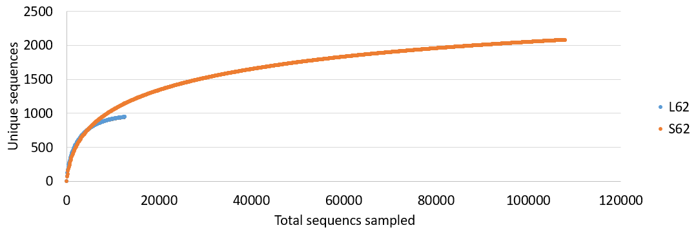
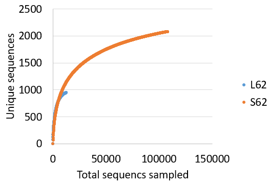
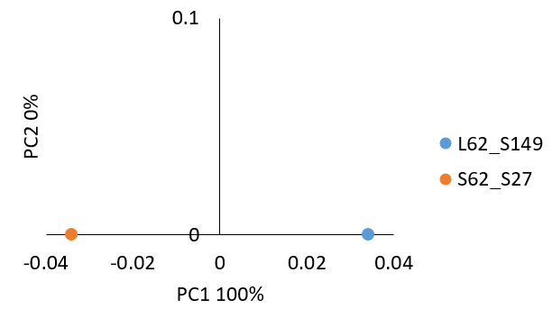

Updated December 19, 2017

Online version available at https://rpubs.com/dillmcfarlan/mothurSOP

#Tips
Indicates steps you need to do during the workshop

You can copy-paste from this document into the `Terminal` window. This will be faster and prevent typos. Depending on your computer, this may be done by

* Ctrl+v
* Apple+v
* Right-click on your mouse

#Introduction
##Goal
The goal of this tutorial is to demonstrate **standard operating procedures (SOP)** for processing amplicon data that are generated using Illumina's MiSeq platform with paired end reads. This SOP is a combination of the Schloss lab and Suen lab (UW-Madison) procedures for 2x250bp reads of the V4 region of the 16S rRNA gene. There are a number of steps, as noted in this SOP, which require modification if you are using a different amplicon and/or read length.

##Sources and citation
This SOP is based on Pat Schloss's MiSeq SOP with some notes and modifications by Dr. Kim Dill-McFarland and Madison Cox. The original SOP can be found at http://www.mothur.org/wiki/MiSeq_SOP.

Published work using this SOP should cite https://www.ncbi.nlm.nih.gov/pubmed/23793624

--- Kozich JJ, Westcott SL, Baxter NT, Highlander SK, Schloss PD. (2013): Development of a dual-index sequencing strategy and curation pipeline for analyzing amplicon sequence data on the MiSeq Illumina sequencing platform. Applied and Environmental Microbiology 79(17): 5112-20. doi: 10.1128/AEM.01043-13.

##Programs
We will complete all sequence processing in the program **mothur** (https://www.mothur.org/wiki/Main_Page). Details on all commands used here as well as others can be found at http://www.mothur.org/wiki/Category:Commands. 

We will use the command-line version of this software on a remote Linux computer. **Windows PC** users will need to download an ssh client for connecting to the remote computer. We recommend the free, personal edition of **MobaXterm** (http://mobaxterm.mobatek.net). This software is a combination of an enhanced terminal window and ssh client.

##Data in this SOP
###Data description
The Suen lab is interested in understanding how rumen (gut) microbes contribute to nutrition and milk production in dairy cows. In this example data set, we are looking at the liquid (L) and solid (S) contents from the rumen (stomachs) of a cow.

We will analyze these data in this tutorial using an OTU (Operational Taxonomic Unit) approach. Other approaches such as phylotype and phylogenetic can be found in the online [Schloss SOP](http://www.mothur.org/wiki/MiSeq_SOP).

The data in this SOP were generated using 16S V4 primers from Kozich *et al*. 2013. These primers allow you to sequence up to 1536 samples in parallel using only 80 primers (32+48) and obtain sequence reads of the V4 region of the 16S rRNA gene. Please consult the supplementary methods of that manuscript for more information. You can also see the latest Schloss wet-lab SOP for generating libraries similar to these (https://github.com/SchlossLab/MiSeq_WetLab_SOP).

###Files
**From the MiSeq**
Sequences come off the MiSeq as pairs of `fastq.gz` files with each pair representing the two paired reads per sample.

`fastq` files contain both the sequence data (fasta) and the quality score data (qual). gz is a form of compression to make the files smaller. If you aren't getting these files off the sequencer, then you likely have the software parameters set incorrectly. The default MiSeq file names are `sample.name_S##_L001_R#_001.fastq` where

* `sample.name` is the name you give the machine when running your library (*i.e.* pool of all samples together)
* `S##` is the sample number given by the machine to ensure all file names are unique
* `L001` is lane 1 (MiSeqs only have one lane as opposed to HiSeqs)
* `R#` is the forward (`R1`) or reverse (`R2`) read for each sample
* `001` is the replicate number, which will always be `001` as the MiSeq requires unique sample names (again, as opposed to the HiSeq)

**All data can be downloaded from [GitHub](https://github.com/kdillmcfarland/workshops_UW_Madison)**

**For mothur**
For this tutorial, you will need our 4 example samples' `fastq.gz` files as well as two databases for alignment and classification. All of these have been pre-downloaded onto `sumo`. However, if you need the databases in the future, they can be found through the mothur website. The database files include

* mothur-formatted Silva sequences, reference alignment, and taxonomy
* mothur-formatted GreenGenes sequences, reference alignment, and taxonomy

**From mothur**
When mothur modifies your data, it creates a new file for each step. For example, if you start out with `Example.fasta` and run screen.seqs to remove poor-quality sequences, mothur will create `Example.good.fasta`. Thus, you can see all the steps you've run just by looking at the file names.

**Note**: It is generally easiest to use the "current" option for many of the commands since the file names get very long. Because this tutorial is meant to show people how to use mothur at a very nuts and bolts level, we will only selectively use the current option to demonstrate how it works. Generally, **we will use the full file names for this tutorial**.

***

#Get Started
##Connect to the BRC Linux Computer
We will remotely connect to the BRC Linux computer named `sumo` for these exercises.

###Connect from a Mac
1. Open a `Terminal` (if you are not sure where that is simply search for the word Terminal with "Spotlight" tool *i.e.* the top right magnifying glass icon)
2. Within the Terminal, type the following command adapted with **your own studentxx account** (shown here for `student01`):
`ssh -Y student01@sumo.biotech.wisc.edu`
3. The `-Y` option allows passing of any graphics from the BRC Linux computer. The XQartz program should be installed for this to work (See https://www.xquartz.org)
4. `sumo` is the name of the computer.

###Connect from a Windows PC
There are 2 ways to connect to a remote computer:

**Standard connection**

1. Start MobaXterm
2. In the main window, type the ssh command containing **your username** and the computer name. For example for `student01`, you would write: `ssh -Y student01@sumo.biotech.wisc.edu`

**GUI method connection**

1. Start MobaXterm
2. In the **QuickConnect** text box (upper left), enter the name of the computer you want to connect to: *e.g.* `@sumo.biotech.wisc.edu`
3. Press the `Return` button
4. In the next window, click on the `SSH` icon (upper left). Click OK
5. At the "Login:" prompt that appears within the main window, enter the username provided *e.g.* `student01`
6. Enter the password provided (*Note*: nothing gets printed)
7. You may be asked if you want to save the password. Click NO
8. You should now be logged in the remote computer on the main window.

##Home directory
Once you have connected to the `sumo` computer, you "land" within your "Home" directory. For `student01`, this would be:

```{}
/home/BIOTECH/student01
```

If at any point you get lost within the labyrinth of directories, simply type `cd` to come back.

To know where your terminal is "looking" at any moment, you can invoke the print working directory command: `pwd`

##`$` prompt
The `$` in the `Terminal` is simply a way for the computer to notify you that it is ready to receive typed commands. ** *Note*: The `$` is not typed when issuing commands. It is already there.**

For example, `student01` would see the following `Terminal` prompt:

```{}
[student01@sumo ~]$
```

##Project folder: Stay organized
It is a general good practice to create a project folder or working directory in order to separate files from various projects. We will use the name `MiSeq_SOP`. Therefore, our first task is to create this directory within the most logical place: our "Home" directory.

First we can verify that we are indeed within the "Home" directory with the *print working directory command* `pwd`.
```{}
$ pwd
```
```{}
$ /home/BIOTECH/student01
```

Then, we create the directory with `mkdir`

**Create a project folder**
```{}
$ mkdir MiSeq_SOP
```

We can verify that this directory exists by checking the content of our "Home" directory with the list command `ls`
```{}
$ ls
```
```{}
MiSeq_SOP
```

Next, move into your MiSeq_SOP folder. This will be done with the *change directory* command `cd` into MiSeq_SOP:

**Change directory**
```{}
$ cd MiSeq_SOP
```

We can check that this worked with the command *print working directory* `pwd`. For `student01`, this would look like:
```{}
$ pwd
```
```{}
$ /home/BIOTECH/student01/MiSeq_SOP
```

##Get data files
In this section, we will retrieve the data files for our 6 samples. Remember that there are `R1` and `R2` files so we will end up with 12 `fastq.gz` files.

**Note**: If you wanted to download files from the Internet, you could use the command *web get* `wget` followed by the URL, or web address of the file to download.
For example: `wget https://www.mothur.org/w/images/d/d6/MiSeqSOPData.zip`

###Sequence `fastq`
We will retrieve fastq files for our 2 samples (4 files). We will copy `cp` a zipped folder containing the files that has already been downloaded to the local computer located in the directory: `/mnt/software/workshop/data/MOTHUR/`. Then, you will unzip these files and move `mv` them into your `MiSeq_SOP` folder.

**Copy data files into home directory**

```{}
$ cp /mnt/software/workshop/data/MOTHUR/fastq.zip ~/MiSeq_SOP
```
**Note**: ~ is a representation of the home directory, `/home/BIOTECH/student01` with your student number

Nothing will be printed to the window so check that the file has been moved.
```{}
$ ls
```
```{}
fastq.zip
```

Now, unzip the folder to pull out all the `fastq.gz` files. Remember to **change the student## to your number**

**Unzip data files**
```{}
$ unzip /home/BIOTECH/student01/MiSeq_SOP/fastq.zip
```

This will place all of the files in a folder named the same thing as the zipped object (*i.e.* `fastq`). 
```{}
ls
```
```{}
fastq/
fastq.zip
```

So we need to move the `fastq.gz` files from `fastq/` into `MiSeq_SOP/`. We can move all of the files ending in `fastq.gz` at once with the wildcard `*`

```{}
$ mv /home/BIOTECH/student01/MiSeq_SOP/fastq/*fastq.gz ~/MiSeq_SOP
```

You can then check the content of the directory with the list `ls` command.
```{}
$ ls
```
```{}
fastq/
fastq.zip
L62.1_S149_L001_R1_001.fastq.gz
L62.1_S149_L001_R2_001.fastq.gz
S62.1_S27_L001_R1_001.fastq.gz
S62.1_S27_L001_R2_001.fastq.gz
```

For these samples, the sample names are coded as sampleCow.day. For example, L62.1 is the liquid sample from cow #62 on day 1. These sequences are 250 bp and overlap in the V4 region of the 16S rRNA gene; this region is about 253 bp long.

###Databases
We will now copy the Silva and GreenGenes database files into your home folders with `cp`. For alignment, we will be using a reduced version of Silva that only contains the V4 region of 16S since we know that is our amplicon region. A full Silva database is available at https://www.mothur.org/wiki/Silva_reference_files. Also, because `silva.v4.align` is large, it is zipped and will need to be unzipped once in your folder. 

All of these files are located in `/mnt/software/mothur/reference_databases/`

* silva.v4.align.zip
* silva.nr_v123.tax
* gg_13_8_99.fasta
* gg_13_8_99.gg.tax

**Retrieve databases**
```{}
$ cp /mnt/software/mothur/reference_databases/silva.v4.align.zip ~/MiSeq_SOP
$ cp /mnt/software/mothur/reference_databases/silva.nr_v123.tax ~/MiSeq_SOP
$ cp /mnt/software/mothur/reference_databases/gg_13_8_99.fasta ~/MiSeq_SOP
$ cp /mnt/software/mothur/reference_databases/gg_13_8_99.gg.tax ~/MiSeq_SOP
```

**Unzip align file**
```{}
$ unzip ~/MiSeq_SOP/silva.v4.align.zip
```

`Silva.v4.align.zip` was a single zipped file and therefore, was not placed in a new folder like the `fastq.gz` files. So, it does not need to be moved.

If you do a final check of your folder, you should have all of the following files.
```{}
$ ls
```
```{}
fastq/
fastq.zip 
gg_13_8_99.fasta
gg_13_8_99.gg.tax
L62.1_S149_L001_R1_001.fastq.gz
L62.1_S149_L001_R2_001.fastq.gz
S62.1_S27_L001_R1_001.fastq.gz
S62.1_S27_L001_R2_001.fastq.gz
silva.nr_v123.tax
silva.v4.align
silva.v4.align.zip
```

***

#Begin in mothur
The software mothur is installed on the BRC Linux computer `sumo` and will be accessed via command-line on the Terminal. We can check that the computer knows about the software with the command `which`. This will echo back the location of the software:

```{}
$ which mothur
```
```{}
/mnt/software/mothur/default/mothur
```

We can also verify the version that is installed. It is important to note the version used as the calculations or command syntax may differ slightly with different versions.

We can check what version is installed with the following command that will print out the results on the screen:

```{}
$ mothur --version
```
```{}
Linux 64Bit Version
mothur version=1.39.5
Release Date=3/6/2017
```

##General mothur syntax
mothur automatically creates file names based on commands run with that file.

Sometimes new versions slightly change the output names which cause later commands to fail as they cannot find the correct file. For example, version 1.35 outputs the file `...precluster.uchime.accnos` after chimera.uchime while version 1.36 outputs `...precluster.denovo.uchime.accnos` because new options were added and it now specifies that you used the denovo method.

If you are having issues, the first thing to check is whether or not all the needed input files exist and are named exactly what they are in your command. If they are not, make the necessary changes to the next command and try re-running.

We will run these exercises on the `sumo` BRC Linux computer which as a total of 32 processors and 512 Gb (1/2 Tb) of RAM. These resources have to be shared among all the attendees in class. For example if there are 15 students, each could use 2 processors.

If you were to run on your desktop or laptop computer on your own the following recommendations from Kim would be useful:

--- Before you begin, there are some things to consider. If this is your first time using mothur, I recommend running through this tutorial will only 2 samples so that you can get used to command line and identify any problem areas without having to wait for computationally intensive steps to run. This will also minimize RAM load so that you can practice on your own computer before moving to larger server usage (more about that below).

--- Once you move up to a bigger data set, you need to consider the computer you're running mothur on. Many commands can be run on multiple processors by adding processors = #. However, you can only use as many as your computer actually has.
A good rule of thumb is to not run mothur using more than (all of your processors - 2). This leaves 1 processor for your OS and 1 for any other programs you may have open. Try to minimize other things open if possible. The other thing to consider is RAM. If you have very little RAM, only run mothur with 1 processor to minimize RAM load. This will make this very slow going and a laptop might still run out of RAM and crash. It's impossible to say exactly how much RAM you will need for a given data set. So, when thinking about running a large data set consisting of an entire MiSeq run or more, consider getting access to 0.5TB+ RAM machines. Madison has these resources available through the Center for High Throughput Computing, http://chtc.cs.wisc.edu/.

##Start mothur via command line
We can now start the program. We will all call the same path to execute mothur in our own folders. Since we are each in our own `MiSeq_SOP` folders, mothur will automatically save your files to your folder. Note that once this command is issued, we will be working within the mothur software as reminded by the new prompt `mothur >` which will only accept mothur line commands.

**Start mothur**
```{}
$ /mnt/software/mothur/default/mothur
```
```{}
mothur v.1.39.5
Last updated: 3/6/2017

by
Patrick D. Schloss

Department of Microbiology & Immunology
University of Michigan
http://www.mothur.org

When using, please cite:
Schloss, P.D., et al., Introducing mothur: Open-source, platform-independent, community-supported software for describing and comparing microbial communities. Appl Environ Microbiol, 2009. 75(23):7537-41.

Distributed under the GNU General Public License

Type 'help()' for information on the commands that are available

For questions and analysis support, please visit our forum at https://www.mothur.org/forum

Type 'quit()' to exit program


mothur >
```

If for some reason the default version of mothur is not v1.39.5, quit mothur with
```{}
mothur > quit
```

and then use the following to access the latest version
```{}
$ /mnt/software/mothur/versions/mothur_v.1.39.5/mothur
```

***

#Basic sequence clean-up
##Combine paired end reads
Paired-end runs on the Illumina MiSeq yield two reads for every sequence. One running in from the 5 prime end (read 1, `R1`) and one from the 3 prime end (read 2, `R2`). You need to combine these reads so that there is a single, longer read for every sequence (a contig). You do this by determining the overlapping regions and combining with the `make.contigs` command.

image:


This command will:
* extract the sequence and quality score data from your 'fastq' files
* create the reverse complement of the reverse read and then
* join the reads into contigs

We have a very simple algorithm to do this. First, we align the pairs of sequences. Next, we look across the alignment and identify any positions where the two reads disagree. If one sequence has a base and the other has a gap, the quality score of the base must be over 25 to be considered real. If both sequences have a base at that position, then we require one of the bases to have a quality score 6 or more points better than the other. If it is less than 6 points better, then we set the consensus base to an N.

You could run `make.contigs` on each sample individually and then combine the outputs. However, this is very time consuming. So, `make.contigs` can also take a tab-delimited file listing all the samples and their corresponding file names. We will have mothur make this file using `make.file`. **Remember to change to your student number!**

**`make.file`**

```{}
mothur > make.file(inputdir=/home/BIOTECH/student01/MiSeq_SOP, type=gz)
```
```{}
Setting input directory to: /home/BIOTECH/student01/MiSeq_SOP/

Output File Names: 
/home/BIOTECH/student01/MiSeq_SOP/stability.files
```

This will output a `.files` which is setup as

sample name -tab- `R1`file -tab- `R2`file

Let's take a look at it.

```{}
mothur > system(head -5 stability.files)
```
```{}
L62_S149	/home/BIOTECH/student01/MiSeq_SOP/L62.1_S149_L001_R1_001.fastq.gz	/home/BIOTECH/student01/MiSeq_SOP/L62.1_S149_L001_R2_001.fastq.gz	
S62_S27	/home/BIOTECH/student01/MiSeq_SOP/S62.1_S27_L001_R1_001.fastq.gz	/home/BIOTECH/student01/MiSeq_SOP/S62.1_S27_L001_R2_001.fastq.gz	

```

**Note**: If you name two sets of files the same, they will be merged into one sample during make.contigs. This is useful if you sequenced a sample more than once.

**Note**: Your sample names cannot contain a dash (-) as mothur uses this symbol to denote lists in some commands.

Sometimes mothur will not correctly name your samples (left most column of .files). So we will open the file and manually enter our names.

Also, "stability" is not a useful name for us so we're going to re-name this file so that all subsequent files are named correctly. We can do this while still in mothur by using the `system` command.

**Rename '.files'**

```{}
mothur > system(cp stability.files example.files)
```

**Note**: If you were running on a Windows PC, you would use "copy" instead of "cp" since the system command calls upon the operating system of the computer. For this SOP, we are all running on Linux on sumo

Now, let's begin our data clean-up by combining `R1` and `R2` with `make.contigs`. **Please wait for instructions** on how many processors to use as this will vary depending on the number of people attending.

**`make.contigs`**

```{}
mothur > make.contigs(file=example.files, processors=2)
```
```{}
>>>>>	Processing file pair /home/BIOTECH/student01/MiSeq_SOP/L62.1_S149_L001_R1_001.fastq.gz - /home/BIOTECH/student01/MiSeq_SOP/L62.1_S149_L001_R2_001.fastq.gz (files 1 of 2)	<<<<<
Making contigs...
Done.

It took 17 secs to assemble 15331 reads.

[truncated]

Group count: 
L62_S149	15331
S62_S27	130107

Total of all groups is 145438

Output File Names: 
/home/BIOTECH/student01/MiSeq_SOP/example.trim.contigs.fasta
/home/BIOTECH/student01/MiSeq_SOP/example.trim.contigs.qual
/home/BIOTECH/student01/MiSeq_SOP/example.contigs.report
/home/BIOTECH/student01/MiSeq_SOP/example.scrap.contigs.fasta
/home/BIOTECH/student01/MiSeq_SOP/example.scrap.contigs.qual
/home/BIOTECH/student01/MiSeq_SOP/example.contigs.groups

[WARNING]: your sequence names contained ':'. I changed them to '_' to avoid problems in your downstream analysis.
```

The *Warning* simply explains that the sequence names have been altered by changing the colon character into the underscore character because the colon character would cause problems for phylogenetic software, as would the dash character - already explained above.

This command will also produce several files that you will need down the road: `example.trim.contigs.fasta` and `example.contigs.groups`. These contain the sequence data and group identity for each sequence. 

The `example.contigs.report` file will tell you something about the contig assembly for each read or why it failed. The file`example.scrap.contigs.fasta` contains sequences that fail to make contigs. The file `example.contigs.groups` contains a list of sequence names (given by the machine) and which sample they belong to.

We should now take a look at our data. This is done repeatedly in this SOP using 'summary.seqs'

**Note**: mothur is smart enough to remember that we used 2 processors in make.contigs and so it will use that throughout your current session unless you specify otherwise.

**`summary.seqs`**

```{}
mothur > summary.seqs(fasta=example.trim.contigs.fasta)
```
```{}
            | Start   | End     | NBases  | Ambigs   | Polymer | NumSeqs
----------- | ------- | ------- | ------- | -------- | ------- | -------
Minimum:    | 1       | 248     | 248     | 0        | 3       | 1
2.5%-tile:  | 1       | 252     | 252     | 0        | 3       | 3636
25%-tile:   | 1       | 253     | 253     | 0        | 3       | 36360
Median:     | 1       | 253     | 253     | 0        | 4       | 72720
75%-tile:   | 1       | 253     | 253     | 0        | 4       | 109079
97.5%-tile: | 1       | 254     | 254     | 5        | 5       | 141803
Maximum:    | 1       | 495     | 495     | 81       | 126     | 145438
Mean:       | 1       | 252.935 | 252.935 | 0.441852 | 3.83601 | 
# of Seqs:  | 145438
```

This output tells us that we have 145,438 sequences that are ~253 bases long.

Things to look out for

* The longest read in the data set is 495 bp. Recall that the reads are supposed to be ~250 bp each. This read clearly didn't assemble well (or at all).
* ~2.5% of our sequences had some ambiguous base calls (*i.e.* N).
* ~2.5% of our sequences have long homopolymers (*i.e.* AAAAAAAAA)

We'll take care of these issues in the next step when we run `screen.seqs`.

##Remove poor quality
This implementation of the command will remove sequences with any ambiguous bases, anything longer than 300 bp, and anything with a homopolymer longer than 8 bases.

**`screen.seqs`**

```{}
mothur > screen.seqs(fasta=example.trim.contigs.fasta, group=example.contigs.groups, maxambig=0, maxlength=300, maxhomop=8)
```
```{}
Processing sequence: 100
Processing sequence: 200

[truncated]

Processing sequence: 14500
Processing sequence: 14535

Output File Names: 
/home/BIOTECH/student01/MiSeq_SOP/example.trim.contigs.good.fasta
/home/BIOTECH/student01/MiSeq_SOP/example.trim.contigs.bad.accnos
/home/BIOTECH/student01/MiSeq_SOP/example.contigs.good.groups
```

Alternate command: There's another way to run this using the output from `summary.seqs`. This may be faster because the `summary.seqs` output file already has the number of ambiguous bases and sequence length calculated for your sequences. 

```{}
mothur > screen.seqs(fasta=example.trim.contigs.fasta, group=example.contigs.groups, summary=example.trim.contigs.summary, maxambig=0, maxlength=300, maxhomop=8)
```

##Using "current"
Now that we've created some files in mothur, we can ask mothur what it knows about our current session.

**`get.current`**

```{}
mothur > get.current()
Current RAM usage: 0.0295715 Gigabytes. TOtal RAM: 252.232 Gigabytes.

Current files saved by mothur:
fasta=example.trim.contigs.good.fasta
group=example.contigs.good.groups
qfile=example.trim.contigs.qual
processors=2
summary=example.trim.contigs.summary

Current default directory saved by mothur: /home/BIOTECH/student01/MiSeq_SOP/

Current working directory: /home/BIOTECH/student01/MiSeq_SOP/
```

What this means is that mothur remembers your latest `fasta` and `group` file as well as the number of processors you are running on. This is useful because you can shorten commands by telling mothur to use the current files. So all of the following are equivalent at this point in analysis and you would get the same output for each.

```{}
mothur > summary.seqs(fasta=example.trim.contigs.good.fasta)
mothur > summary.seqs(fasta=current)
mothur > summary.seqs()
```
```{}
            | Start   | End     | NBases  | Ambigs   | Polymer | NumSeqs
----------- | ------- | ------- | ------- | -------- | ------- | -------
Minimum:    | 1       | 250     | 250     | 0        | 3       | 1
2.5%-tile:  | 1       | 252     | 252     | 0        | 3       | 3139
25%-tile:   | 1       | 253     | 253     | 0        | 3       | 31386
Median:     | 1       | 253     | 253     | 0        | 4       | 62771
75%-tile:   | 1       | 253     | 253     | 0        | 4       | 94156
97.5%-tile: | 1       | 254     | 254     | 0        | 5       | 122402
Maximum:    | 1       | 294     | 294     | 0        | 8       | 125540
Mean:       | 1       | 252.889 | 252.889 | 0        | 3.82739 | 
# of Seqs:  | 125540
```
**Note**: If you exit out of mothur and then re-start, it will not remember the current files from your last session.

For the purposes of this tutorial, we will write out the names of the files for clarity. 

##Unique sequences
At this point, our sequencing error rate has probably dropped more than an order of magnitude and we have 125,540 sequences We anticipate that many of our sequences are duplicates of each other. Because it's computationally wasteful to process the same thing a bazillion times, we'll select only unique sequences using the `unique.seqs` command. This way, the computer can analyze one sequence and then apply that outcome to every identical sequence in the data set.

**`unique.seqs`**

```{}
mothur > unique.seqs(fasta=example.trim.contigs.good.fasta)
```
```{}
[truncated]

125000  20396
125540	20469

Output File Names: 
/home/BIOTECH/student01/MiSeq_SOP/example.trim.contigs.good.names
/home/BIOTECH/student01/MiSeq_SOP/example.trim.contigs.good.unique.fasta
```

If two sequences have the same identical sequence, then they're considered duplicates and will get merged.

In the screen output there are two columns:

* the first is the number of sequences characterized and
* the second is the number of unique sequences remaining.

So after running unique.seqs we have gone from 125,540 total to 20,469 unique sequences. This will make our life much easier moving forward.

##Simplify names and groups with counts
Another thing to do to make our lives easier is to simplify the `names` and `group` files. mothur carefully keeps track of the name (`.names` file) and group (*i.e.* sample name, `.groups` file) for every single sequence. To make later commands shorter, we combine the data in these files into a single "count" file (`.count_table`).

So we'll run `count.seqs to` generate a table where the rows are the names of the unique sequences and the columns are the names of the groups. The table is then filled with the number of times each unique sequence shows up in each group.

**`count.seqs`**

```{}
mothur > count.seqs(name=example.trim.contigs.good.names, group=example.contigs.good.groups)
```
```{}
Total number of sequences: 125540

Output File Names: 
/home/BIOTECH/student01/MiSeq_SOP/example.trim.contigs.good.count_table
```

This will generate a file called `example.trim.contigs.good.count_table`. In subsequent commands, we'll use this file with the `count=` option.

Let's look at another summary of our data using this count table.

**`summary.seqs` with `count_table`**

```{}
mothur > summary.seqs(count=example.trim.contigs.good.count_table)
```
```{}
                 | Start   | End     | NBases  | Ambigs   | Polymer | NumSeqs
---------------- | ------- | ------- | ------- | -------- | ------- | -------
Minimum:         | 1       | 250     | 250     | 0        | 3       | 1
2.5%-tile:       | 1       | 252     | 252     | 0        | 3       | 3139
25%-tile:        | 1       | 253     | 253     | 0        | 3       | 31386
Median:          | 1       | 253     | 253     | 0        | 4       | 62771
75%-tile:        | 1       | 253     | 253     | 0        | 4       | 94156
97.5%-tile:      | 1       | 254     | 254     | 0        | 5       | 122402
Maximum:         | 1       | 294     | 294     | 0        | 8       | 125540
Mean:            | 1       | 252.889 | 252.889 | 0        | 3.82739 | 
# of Seqs:       | 20469
total # of seqs: | 125540
```

We see that now, by including a fasta **and** count_table, we see "# of unique seqs" and "total # of seqs". We would get the same result with `summary.seqs(name=example.trim.contigs.good.names, group=example.contigs.good.groups)`.

##Alignment
Now we need to align our sequences to a reference alignment using `align.seqs`. Your sequences aren't just random strings of nucleotides; they are part of a known gene (usually 16S, 18S, or ITS).

We have two options for 16S alignment: Silva or GreenGenes. **Only use Silva**. GreenGenes contains incomplete (not full length) 16S sequences which make alignment difficult and error-prone. We will also improve our alignment by including `flip=T` so that mothur checks both the forward and reverse complement of our sequences.

The first time you work with an amplicon (*i.e.* primer set), it's a good idea to align to the full database to find out where your sequences align to. This is demonstrated below for V4 but **should not be run during the workshop** as it will take a long time and use a lot of RAM.

Instead, we will start aligning to the pre-made custom reduced alignment database you transferred earlier (`silva.v4.align`). 

**`align.seqs`**

```{}
mothur > align.seqs(fasta=example.trim.contigs.good.unique.fasta, reference=silva.v4.align, flip=T)
```
```{}
Reading in the /home/BIOTECH/student01/MiSeq_SOP/silva.v4.align template sequences...	DONE.
It took 51 to read  172418 sequences.
Aligning sequences from /home/BIOTECH/student01/MiSeq_SOP/example.trim.contigs.good.unique.fasta ...
100
200

[truncated]

20400
20469

It took 182 secs to align 20469 sequences.


Output File Names: 
/home/BIOTECH/student01/MiSeq_SOP/example.trim.contigs.good.unique.align
/home/BIOTECH/student01/MiSeq_SOP/example.trim.contigs.good.unique.align.report
```

###Custom reduced database
Even with a reduced database, this may take several minutes to run. We will go over how this reduced database was created in the interim. First, we aligned to the full Silva database.

**DO NOT RUN THIS** 
```{}
mothur > align.seqs(fasta=example.trim.contigs.good.unique.fasta, reference=silva.nr_v123.align, flip=T)
```
```{}
Reading in the /home/BIOTECH/student01/MiSeq_SOP/silva.nr_v123.align template sequences...	DONE.
It took 506 to read  172418 sequences.
Aligning sequences from /home/BIOTECH/student01/MiSeq_SOP/example.trim.contigs.good.unique.fasta ...
It took 363 secs to align 20469 sequences.


Output File Names: 
/home/BIOTECH/student01/MiSeq_SOP/example.trim.contigs.good.unique.align
/home/BIOTECH/student01/MiSeq_SOP/example.trim.contigs.good.unique.align.report

```

Then we `summary.seqs` to see where we aligned to:

**DO NOT RUN THIS** 
```{}
mothur > summary.seqs(fasta=example.trim.contigs.good.unique.align, count=example.trim.contigs.good.count_table)
```
```{}
                 | Start   | End     | NBases  | Ambigs   | Polymer | NumSeqs
---------------- | ------- | ------- | ------- | -------- | ------- | -------
Minimum:         | 13125   | 23439   | 250     | 0        | 3       | 1
2.5%-tile:       | 13862   | 23444   | 252     | 0        | 3       | 3139
25%-tile:        | 13862   | 23444   | 253     | 0        | 3       | 31386
Median:          | 13862   | 23444   | 253     | 0        | 4       | 62771
75%-tile:        | 13862   | 23444   | 253     | 0        | 4       | 94156
97.5%-tile:      | 13862   | 23444   | 254     | 0        | 5       | 122402
Maximum:         | 13875   | 26147   | 294     | 0        | 8       | 125540
Mean:            | 13862   | 23444.1 | 252.889 | 0        | 3.82739 | 
# of Seqs:       | 20469
total # of seqs: | 125540
```

So what does this mean?

You'll see that the bulk of the sequences start at position **13862** (Start column) and end at position **23444** (End column). But some sequences start or end at other places. These deviants are likely due to an insertion or deletion at the terminal ends of the alignments. Sometimes you'll see sequences that start and end at the same position indicating a very poor alignment, which is generally due to non-specific amplification.

It is these *Start* and *End* values that we need to make a custom reduced database. These values are different for different amplicons/primers and sometimes for different versions/releases of a database. So, once you know them for your amplicon and a given version of Silva, you won't have to do this step again.

We make a database customized to our region of interest using the `pcr.seqs` command. To run this command, you need to have the full reference database (*i.e.* `silva.nr_v123.align`) and know where in that alignment your amplicon starts and ends (from the above summary). To remove the leading and trailing dots, we will set `keepdots` to false.

**DO NOT RUN THIS** 
```{}
mothur > pcr.seqs(fasta=silva.nr_v123.align, start=13862, end=23444, keepdots=F)
```
```{}
Output File Names: 
/home/BIOTECH/student01/MiSeq_SOP/silva.nr_v123.pcr.align
```

We would then rename this file so we know which region we selected

**DO NOT RUN THIS** 
```{}
mothur > system(mv silva.nr_v123.pcr.align silva.v4.align)
```

**Note**: Windows users should use "rename" rather than "mv"" since the system command calls upon the operating system of the computer. For this SOP, we are all running on Linux on sumo

Now we have a **customized reduced reference alignment** to align our sequences to. The nice thing about this reference is that instead of being 50,000 columns wide, it is now 13,425 columns wide which will save our hard drive some space and  improve the overall alignment quality and efficiency. 

`silva.v4.align` is the database we started an alignment to earlier. Once that is done, we `summary.seqs` again.

**`summary.seqs` post alignment**

```{}
mothur > summary.seqs(fasta=example.trim.contigs.good.unique.align, count=example.trim.contigs.good.count_table)
```
```{}
                 | Start   | End  | NBases  | Ambigs   | Polymer | NumSeqs
---------------- | ------- | ---- | ------- | -------- | ------- | -------
Minimum:         | 8       | 9577 | 231     | 0        | 3       | 1
2.5%-tile:       | 8       | 9582 | 251     | 0        | 3       | 3139
25%-tile:        | 8       | 9582 | 252     | 0        | 3       | 31386
Median:          | 8       | 9582 | 252     | 0        | 4       | 62771
75%-tile:        | 8       | 9582 | 252     | 0        | 4       | 94156
97.5%-tile:      | 8       | 9582 | 253     | 0        | 5       | 122402
Maximum:         | 13      | 9582 | 256     | 0        | 8       | 125540
Mean:            | 8.00009 | 9582 | 251.886 | 0        | 3.82739 | 
# of Seqs:       | 20469
total # of seqs: | 125540
```

##Rescreen
To make sure that everything overlaps the same region we'll re-run `screen.seqs`. Note that we need to include the count table in this command so that we can update the table for the sequences we're removing. 

We're also using the summary file we just made so we don't have to figure out all the start and stop positions again. To this end, we will specify the following within the command: `start=8, end=9582`. These numbers are very different from those using the full Silva database because the numbering starts from the 5 prime end and we've removed a bunch of bases from that end with `pcr.seqs`

**`screen.seqs` post alignment**

```{}
mothur > screen.seqs(fasta=example.trim.contigs.good.unique.align, count=example.trim.contigs.good.count_table, summary=example.trim.contigs.good.unique.summary, start=8, end=9582)
```
```{}
Processing sequence: 100
Processing sequence: 200

[truncated]

Processing sequence: 12100
Processing sequence: 12140

Output File Names: 
/home/BIOTECH/student01/MiSeq_SOP/example.trim.contigs.good.unique.good.summary
/home/BIOTECH/student01/MiSeq_SOP/example.trim.contigs.good.unique.good.align
/home/BIOTECH/student01/MiSeq_SOP/example.trim.contigs.good.unique.bad.accnos
/home/BIOTECH/student01/MiSeq_SOP/example.trim.contigs.good.good.count_table
```

And we summarize to see how re-screening impacted the data.

**`summary.seqs`**

```{}
mothur > summary.seqs(fasta=example.trim.contigs.good.unique.good.align, count=example.trim.contigs.good.good.count_table)
```
```{}
                 | Start | End  | NBases  | Ambigs   | Polymer | NumSeqs
---------------- | ----- | ---- | ------- | -------- | ------- | -------
Minimum:         | 8     | 9582 | 231     | 0        | 3       | 1
2.5%-tile:       | 8     | 9582 | 251     | 0        | 3       | 3132
25%-tile:        | 8     | 9582 | 252     | 0        | 3       | 31314
Median:          | 8     | 9582 | 252     | 0        | 4       | 62628
75%-tile:        | 8     | 9582 | 252     | 0        | 4       | 93942
97.5%-tile:      | 8     | 9582 | 253     | 0        | 5       | 122124
Maximum:         | 8     | 9582 | 256     | 0        | 8       | 125255
Mean:            | 8     | 9582 | 251.888 | 0        | 3.82688 | 
# of Seqs:       | 20286
total # of seqs: | 125255
```

##Filter
Now that we know our sequences overlap the same alignment coordinates, we also want to make sure they only overlap that region. We'll filter the sequences to remove the overhangs at both ends with `vertical=T`. Since we've done paired-end sequencing, this shouldn't be much of an issue.

Also, when aligning, mothur puts in a lot of spaces and dots to show insertions and deletions compared to the alignment database. Therefore, there are many columns in the alignment that only contain gap characters (*i.e.* -). This is confusing to later commands (and causes them to fail) so we remove them all with `trump=.`.

**`filter.seqs`**

```{}
mothur > filter.seqs(fasta=example.trim.contigs.good.unique.good.align, vertical=T, trump=.)
```
```{}
Creating Filter... 
100
200

[truncated]

Running Filter... 
100
200

[truncated]

2000
2028

Length of filtered alignment: 416
Number of columns removed: 9166
Length of the original alignment: 9582
Number of sequences used to construct filter: 20286

Output File Names: 
/home/BIOTECH/student01/MiSeq_SOP/example.filter
/home/BIOTECH/student01/MiSeq_SOP/example.trim.contigs.good.unique.good.filter.fasta
```

This means that our initial alignment was 9582 columns wide and that we were able to remove 9166 terminal gap characters using `trump=.` and `vertical=T`. The final alignment length is 416 columns. 

Because we've perhaps created some redundancy across our sequences by trimming the ends, we can re-run `unique.seqs`

**`unique.seqs` again**

```{}
mothur > unique.seqs(fasta=example.trim.contigs.good.unique.good.filter.fasta, count=example.trim.contigs.good.good.count_table)
```
```{}
1000   997
2000   1992

[truncated]

20000 19922
20286	20208

Output File Names: 
example.trim.contigs.good.unique.good.filter.count_table
example.trim.contigs.good.unique.good.filter.unique.fasta
```

This identified 78 duplicate sequences that we've now merged with previous unique sequences.

##Pre-cluster
The next thing we want to do to further de-noise our sequences is to pre-cluster the sequences that are very similar. We'll use the `pre.cluster` command allowing for **up to 2 differences** between sequences by adding `diffs=2` to the command.

This command will split the sequences by group and then sort them by abundance and go from most abundant to least and identify sequences that are within 2 nt of each other. If they are, then they get merged.

We generally favor allowing 1 difference for every 100 bp of sequence, hence a 250bp amplicon is `diffs=2`:

**`pre.cluster`**

```{}
mothur > pre.cluster(fasta=example.trim.contigs.good.unique.good.filter.unique.fasta, count=example.trim.contigs.good.unique.good.filter.count_table, diffs=2)
```
```{}
Processing group L62_S149:
2657	1307	1350
Total number of sequences before pre.cluster was 2657.
pre.cluster removed 1350 sequences.

It took 0 secs to cluster 2657 sequences.

Processing group S62_S27:
18736	4996	13740
Total number of sequences before pre.cluster was 18736.
pre.cluster removed 13740 sequences.

It took 9 secs to cluster 18736 sequences.
It took 10 secs to run pre.cluster.

Output File Names: 
example.trim.contigs.good.unique.good.filter.unique.precluster.fasta
example.trim.contigs.good.unique.good.filter.unique.precluster.count_table
example.trim.contigs.good.unique.good.filter.unique.precluster.L62_S149.map
example.trim.contigs.good.unique.good.filter.unique.precluster.S62_S27.map
```

**`summary.seqs`**

```{}
mothur > summary.seqs(fasta=example.trim.contigs.good.unique.good.filter.unique.precluster.fasta, count=example.trim.contigs.good.unique.good.filter.unique.precluster.count_table)
```
```{}
                 | Start | End | NBases  | Ambigs   | Polymer | NumSeqs
---------------- | ----- | --- | ------- | -------- | ------- | -------
Minimum:         | 1     | 416 | 231     | 0        | 3       | 1
2.5%-tile:       | 1     | 416 | 251     | 0        | 3       | 3132
25%-tile:        | 1     | 416 | 252     | 0        | 3       | 31314
Median:          | 1     | 416 | 252     | 0        | 4       | 62628
75%-tile:        | 1     | 416 | 252     | 0        | 4       | 93942
97.5%-tile:      | 1     | 416 | 253     | 0        | 5       | 122124
Maximum:         | 1     | 416 | 256     | 0        | 8       | 125255
Mean:            | 1     | 416 | 251.896 | 0        | 3.82318 | 
# of Seqs:       | 5614
total # of seqs: | 125255
```

Note that we've gone from 20,208 to 5,614 unique sequences but our total # of sequences has not changed. This is because no sequences were removed; they were just grouped similarly to `unique.seqs` but allowing up to 2 differences.

It is not uncommon to drastically reduce your unique sequence count with this command. The MiSeq is good but not perfect.

At this point we have removed as much sequencing error as we can, and it is time to turn our attention to removing chimeras.

##Chimeras
Chimeras occur when the polymerase falls off one sequence and then reattaches to another during a single round of PCR. This results in a sequence that looks unique but is, in fact, just half of one and half of another *e.g.* not real.

We will remove chimeras with the *UCHIME* algorithm that is called within mothur using the `chimera.uchime` command.

Again, this command will split the data by sample and check for chimeras.

Our preferred way of doing this is to use the abundant sequences as our reference. In addition, if a sequence is flagged as chimeric in one sample, the default (`dereplicate=F`) is to remove it from all samples. Our experience suggests that this is a bit aggressive since we've seen rare sequences get flagged as chimeric when they're the most abundant sequence in another sample.

**`chimera.uchime`**

```{}
mothur > chimera.uchime(fasta=example.trim.contigs.good.unique.good.filter.unique.precluster.fasta, count=example.trim.contigs.good.unique.good.filter.unique.precluster.count_table, dereplicate=t)
```
```{}
uchime by Robert C. Edgar
http://drive5.com/uchime
This code is donated to the public domain.

Checking sequences from example.trim.contigs.good.unique.good.filter.unique.precluster.fasta ...

It took 12 secs to check 1307 sequences from group L62_S149.

It took 132 secs to check 4996 sequences from group S62_S27.

Output File Names: 
example.trim.contigs.good.unique.good.filter.unique.precluster.denovo.uchime.pick.count_table
example.trim.contigs.good.unique.good.filter.unique.precluster.denovo.uchime.chimeras
example.trim.contigs.good.unique.good.filter.unique.precluster.denovo.uchime.accnos
```

This command only identifies chimeras. We then need to remove them from the data using `remove.seqs`

**`remove.seqs`**

```{}
mothur > remove.seqs(fasta=example.trim.contigs.good.unique.good.filter.unique.precluster.fasta, count=example.trim.contigs.good.unique.good.filter.unique.precluster.count_table, accnos=example.trim.contigs.good.unique.good.filter.unique.precluster.denovo.uchime.accnos)
```
```{}
[NOTE]: The count file should contain only unique names, so mothur assumes your fasta, list and taxonomy files also contain only uniques.

Removed 1297 sequences from your fasta file.
Removed 3488 sequences from your count file.

Output File Names: 
example.trim.contigs.good.unique.good.filter.unique.precluster.pick.fasta
example.trim.contigs.good.unique.good.filter.unique.precluster.pick.count_table
```

**`summary.seqs`**

```{}
mothur > summary.seqs(fasta=example.trim.contigs.good.unique.good.filter.unique.precluster.pick.fasta, count=example.trim.contigs.good.unique.good.filter.unique.precluster.pick.count_table)
```
```{}
                 | Start | End | NBases  | Ambigs   | Polymer | NumSeqs
---------------- | ----- | --- | ------- | -------- | ------- | -------
Minimum:         | 1     | 416 | 241     | 0        | 3       | 1
2.5%-tile:       | 1     | 416 | 251     | 0        | 3       | 3045
25%-tile:        | 1     | 416 | 252     | 0        | 3       | 30442
Median:          | 1     | 416 | 252     | 0        | 4       | 60884
75%-tile:        | 1     | 416 | 252     | 0        | 4       | 91326
97.5%-tile:      | 1     | 416 | 253     | 0        | 5       | 118723
Maximum:         | 1     | 416 | 256     | 0        | 8       | 121767
Mean:            | 1     | 416 | 251.894 | 0        | 3.81946 | 
# of Seqs:       | 4317
total # of seqs: | 121767
```

Note that we went from 125,255 to 121,767 sequences for a reduction of 2.8%; this is a reasonable number of sequences to be flagged as chimeric. In the end, the percent chimeras is a result of the polymerase you used in PCR. A high-fidelity polymerase is less likely to fall off and create chimeras and fewer cycles also result in fewer chimeras.

##Undesirables
As a final quality control step, we need to see if there are any "undesirables" in our data set. Even after all of this cleanup, you can still have "good" sequences that are actually contaminants.

Sometimes when we pick a primer set, they will amplify other stuff that gets to this point in the pipeline such as 18S rRNA gene fragments or 16S rRNA from Archaea, chloroplasts, and mitochondria.

There's also just the random stuff that we want to get rid of. Now you may say, "But wait I want that stuff". Fine. But, the primers we use, are only supposed to amplify members of the Bacteria and if they're hitting Eukaryota or Archaea, then its a mistake. It is important to note that if you do keep these sequences, **they do not** represent the overall archaeal or eukaryotic community. It would be incorrect to use this data as a shortcut to not do an archaea or eukaryote specific MiSeq run.

You may also have other "undesirables" specific to your system of study. For example, the rumen is not home to any Cyanobacteria as it is a dark, anaerobic environment. However, we always get Cyanobacteria sequences back because unfortunately, chloroplasts (very abundant in the feed of herbivores!) look a lot like Cyanobacteria. So we remove them. Not every researcher does this but it is an accepted step as long as you note it in your methods section.

The first step is to classify your sequences so you know what to remove. Let's go ahead and classify using the **Bayesian classifier** with the `classify.seqs command`. You can classify to either Silva or GreenGenes at this point and it will make very little difference. We will use *Silva* here. We will also specific a *cutoff of 80*. This roughly means that we are 80%+ confident in our classification, a good thing if we're going to remove groups. We want to be sure of what we're removing.

**`classify.seqs`**

```{}
mothur > classify.seqs(fasta=example.trim.contigs.good.unique.good.filter.unique.precluster.pick.fasta, count=example.trim.contigs.good.unique.good.filter.unique.precluster.denovo.uchime.pick.count_table, reference=silva.v4.align, taxonomy=silva.nr_v123.tax, cutoff=80)
```
```{}
Generating search database...    DONE.
It took 88 seconds generate search database. 

Reading in the //home/BIOTECH/student01/MiSeq_SOP/silva.nr_v123.tax taxonomy...	DONE.
Calculating template taxonomy tree...     DONE.
Calculating template probabilities...     DONE.
It took 217 seconds get probabilities. 
Classifying sequences from example.trim.contigs.good.unique.good.filter.unique.precluster.pick.fasta ...

It took 125 secs to classify 4317 sequences.


It took 1 secs to create the summary file for 4317 sequences.


Output File Names: 
example.trim.contigs.good.unique.good.filter.unique.precluster.pick.nr_v123.wang.taxonomy
example.trim.contigs.good.unique.good.filter.unique.precluster.pick.nr_v123.wang.tax.summary
```

Note that with some data sets, you will get warnings about things that could not be classified. This looks like
```{}

```
These are labeled as domain 'unknown' if the classifier cannot classify the sequence to Bacteria, Archaea, or Eukaryota.

Now that everything is classified, we want to remove our undesirables. We do this with the `remove.lineage` command. We'll just remove non-Bacteria domains and completely unclassifieds ("unknown").

**`remove.lineage`**

```{}
mothur > remove.lineage(fasta=example.trim.contigs.good.unique.good.filter.unique.precluster.pick.fasta, count=example.trim.contigs.good.unique.good.filter.unique.precluster.denovo.uchime.pick.count_table, taxonomy=example.trim.contigs.good.unique.good.filter.unique.precluster.pick.nr_v123.wang.taxonomy, taxon=unknown;-Archaea;-Eukaryota;)
```
```{}
[NOTE]: The count file should contain only unique names, so mothur assumes your fasta, list and taxonomy files also contain only uniques.


Output File Names: 
example.trim.contigs.good.unique.good.filter.unique.precluster.pick.nr_v123.wang.pick.taxonomy
example.trim.contigs.good.unique.good.filter.unique.precluster.pick.pick.fasta
example.trim.contigs.good.unique.good.filter.unique.precluster.denovo.uchime.pick.pick.count_table
```

**`summary.seqs`**

```{}
mothur > summary.seqs(fasta=example.trim.contigs.good.unique.good.filter.unique.precluster.pick.pick.fasta, count=example.trim.contigs.good.unique.good.filter.unique.precluster.denovo.uchime.pick.pick.count_table)
```
```{}
                 | Start | End | NBases  | Ambigs   | Polymer | NumSeqs
---------------- | ----- | --- | ------- | -------- | ------- | -------
Minimum:         | 1     | 416 | 241     | 0        | 3       | 1
2.5%-tile:       | 1     | 416 | 251     | 0        | 3       | 3014
25%-tile:        | 1     | 416 | 252     | 0        | 3       | 30135
Median:          | 1     | 416 | 252     | 0        | 4       | 60270
75%-tile:        | 1     | 416 | 252     | 0        | 4       | 90404
97.5%-tile:      | 1     | 416 | 253     | 0        | 5       | 117525
Maximum:         | 1     | 416 | 255     | 0        | 8       | 120538
Mean:            | 1     | 416 | 251.892 | 0        | 3.81646 | 
# of Seqs:       | 4299
total # of seqs: | 120538
```

At this point, we have cleaned-up our data as far as possible. Our file names are very long at this point, so let's copy and rename them before moving onto some analysis.

**Rename final files**

```{}
mothur > system(cp example.trim.contigs.good.unique.good.filter.unique.precluster.pick.pick.fasta example.final.fasta)

mothur > system(cp example.trim.contigs.good.unique.good.filter.unique.precluster.denovo.uchime.pick.pick.count_table example.final.count_table)
```

***

#Define OTUs
Now we can define operational taxonomic units (OTUs), the sequencing proxy for a microbial species. We do this by calculating distances between sequences (how difference they are from each other) with `dist.seqs` and then clustering these distances based on a difference cutoff with `cluster.split`. In general, cutoffs are

* 0.03 = 3% different or 97% similar ~ species
* 0.05 = 5% different or 95% similar ~ genus
* 0.1 = 10% different or 90% similar ~ family

**`dist.seqs`**

```{}
mothur > dist.seqs(fasta=example.final.fasta)
```
```{}
0    0
100  1
200  1

[truncated]

3844 11

Output File Names: 
example.final.dist
```

**Note**: There are a couple of tricks to decrease your distance matrix size for large data sets (I've seen V3-4 data get up to 1TB). You can set a "cutoff" in dist.seqs. This causes mothur to not save distance greater than the cutoff. For example, if you're only going to look at genus and species level OTUs, you could set your cutoff to 0.1. You can also output in lower triangle form (output=lt), which only saves one distance for every pairwise comparison. 

For clustering, we have a number of options

* nearest neighbor
* furthest neighbor
* average neighbor
* opticlust

You can find full definitions of these methods [here](https://www.mothur.org/wiki/Cluster.split) but the general view is that furthest is too strict (creates too many OTUs), nearest is too lenient (too few OTUs), and average is in the middle. Sort of a Goldilocks situation.

opticlust is a very new method developed by the Schloss group, and it appears to perform as good or better than average neighbor. For more information, see http://msphere.asm.org/content/2/2/e00073-17

We will use average here.

**`cluster.split`**

```{}
mothur > cluster.split(column=example.final.dist, count=example.final.count_table, method=average)
```
```{}
Splitting the file...
It took 99 seconds to split the distance file.

Reading example.final.dist.0.temp
********************#****#****#****#****#****#****#****#****#****#****#
Reading matrix:     |||||||||||||||||||||||||||||||||||||||||||||||||||
***********************************************************************

Clustering example.final.dist.0.temp
Cutoff was 0.03 changed cutoff to 0.02

[truncated]

Cutoff was 0.03 changed cutoff to 0.02
It took 21 seconds to cluster
Merging the clustered files...
It took 6 seconds to merge.

Output File Names: 
example.final.an.unique_list.list
```

Now that we have OTUs, we'd like to look at them, right? Well, distance and cluster files are not for human eyes. So we use `make.shared` to combine these data with our sample names to create a table we can understand. We will have mothur only give us the species-level OTUs `label=0.03` but you could ask for any level that you like (as long as it's below the cutoff you may have used in `dist.seqs`).

**`make.shared`**

```{}
mothur > make.shared(list=example.final.an.unique_list.list, count=example.final.count_table, label=0.03)
```
```{}
0.03

Output File Names: 
example.final.an.unique_list.shared
```

Let's look at it!!! This file has many, many columns and is difficult to look at in the Terminal. So, we will open the `.shared` file in Excel or a text editor. You'll see that for each sample, we have how many times each OTU occurs in that sample. 

label | Group    | numOtus | Otu0001 | Otu0002 ...
----- | -------- | ------- | ------- | -------
0.03  | L62_S149 | 2204    | 189     | 678     ...
0.03  | S62_S27  | 2204    | 7351    | 6438    ...

#Classify OTUs
Now that you have all these OTUs, what are they? We find out by repeating `classify.seqs` on our final files and then grouping based on our OTUs with `classify.otu`. Here, we will use **GreenGenes** instead of Silva. Like classifying before, you can use either. In general, GreenGenes will give fewer unclassifieds and more classifications down to lower levels. But when you go to research those classifications, they could be from a clone library or other non-culturing technique so there is little you can say about that species. Silva is only full-length 16S so you have fewer sequences to compare to and get more unclassifieds. However, the classifications are more often to cultured species.

There are also specific taxonomic groups that are more or less represented in each database. This would be specific to your system and you'd have to classify to both to find out!

**`classify.seqs`**

```{}
mothur > classify.seqs(fasta=example.final.fasta, count=example.final.count_table, template=gg_13_8_99.fasta, taxonomy=gg_13_8_99.gg.tax, cutoff=80)
```
```{}
Reading template taxonomy...     DONE.
Reading template probabilities...     DONE.
It took 20 seconds get probabilities. 
Classifying sequences from example.final.fasta ...

It took 161 secs to classify 4299 sequences.


It took 0 secs to create the summary file for 4299 sequences.


Output File Names: 
example.final.gg.wang.taxonomy
example.final.gg.wang.tax.summary
```

**`classify.otu`**

```{}
mothur > classify.otu(list=example.final.an.unique_list.list, taxonomy=example.final.gg.wang.taxonomy, count=example.final.count_table, label=0.03, cutoff=80, basis=otu, probs=F)
```
```{}
0.03	2204

Output File Names: 
example.final.an.unique_list.0.03.cons.taxonomy
example.final.an.unique_list.0.03.cons.tax.summary
```

Looking at it.
```{}
mothur > system(head -5 example.final.an.unique_list.0.03.cons.taxonomy)
```
```{}
OTU	Size	Taxonomy
Otu0001	7540	k__Bacteria;p__Proteobacteria;c__Gammaproteobacteria;o__Aeromonadales;f__Succinivibrionaceae;f__Succinivibrionaceae_unclassified;f__Succinivibrionaceae_unclassified;
Otu0002	7116	k__Bacteria;p__Bacteroidetes;c__Bacteroidia;o__Bacteroidales;f__Prevotellaceae;g__Prevotella;s__ruminicola;
Otu0003	5262	k__Bacteria;p__Firmicutes;c__Clostridia;o__Clostridiales;f__Veillonellaceae;g__Succiniclasticum;g__Succiniclasticum_unclassified;
Otu0004	5034	k__Bacteria;p__Bacteroidetes;c__Bacteroidia;o__Bacteroidales;f__Prevotellaceae;g__Prevotella;s__ruminicola;
```

Now, the species level classifications are dicey. Because we don't have full length 16S, we can't say with certainty that OTU2 is *Prevotella ruminicola*. What we can say is that OTU2 is most closely related to *Prevotella ruminicola*, so if we were going to guess at OTU2's function in the cow gut, data on *Prevotella ruminicola* would be a good place to start. And that's not even getting into strain level diversity.

#Coverage
How to you know you have enough sequences to see all/most of the diversity in your samples? Do you need to redo some samples? You can visualize this by rarefaction and calculate it with Good's coverage.

##Rarefaction

**`rarefaction.single`**

```{}
mothur > rarefaction.single(shared=example.final.an.unique_list.shared)
```
```{}
Processing group L62_S149

0.03

Processing group S62_S27

0.03

Output File Names: 
example.final.an.unique_list.groups.rarefaction
```

This will produce a file called `example.final.an.unique_list.groups.rarefaction`. Looking at it...
```{}
mothur > system(head -15 example.final.an.unique_list.groups.rarefaction)
```
```{}
numsampled	0.03-L62_S149	lci-L62_S149	hci-L62_S149	0.03-S62_S27	lci-S62_S27	hci-S62_S27
1	          1	             1	          1	            1	            1           1
100       	71.4920	       63	          80	          65.6890	      57         	74
200       	123.8100	     112	        136	          111.8440	    101	        123
300	        167.9220	     154	        183	          150.7890    	137	        165
400       	206.6730	     192	        223	          185.2670	    169	        200
500       	241.3460	     225	        258	          216.2650	    198	        232
600 	      272.5670	     255	        290	          244.5300	    225	        262
700       	300.9320	     283	        320	          270.6930    	251	        290
800 	      327.0350	     309	        346	          295.0480	    275	        316
900 	      351.3850	     332	        373	          317.8860	    297	        340
1000	      373.9970	     354	        395	          339.1980	    317	        361
1100	      395.0880	     376	        416	          359.2910	    337	        382
1200	      414.7530	     395	        436	          378.2990	    355	        402
1300	      433.4830	     414	        455	          396.3390	    373	        420
```

it's difficult to tell what's going on. The best way to use this data is to graph it and look from the new unique sequences gained per ## of sequences added to level off. At a certain point, you need 1000s of sequences to get only 1 more unique sequence so it's not worth it (and probably not even real)

For example (made in Excel)


However, this doesn't numerically/statistically show you your coverage and is subject to axis-skewing. For example, our coverage looks pretty good in the above plot, but if we compress the x-axis, it doesn't look nearly as good.


Thus, it is better to also calculate coverage with another method, like Good's.

##Good's coverage
The metric is an estimate of the percent of diversity (species) captured in a sample by your current sequencing data. In general, we're looking for 95% or better. We can also look at the number of sequence `nseqs` and number of unique OTUs `sobs` in each sample.

**`summary.single`**

```{}
mothur > summary.single(shared=example.final.an.unique_list.shared, label=0.03, calc=nseqs-sobs-coverage)
```
```{}
Processing group L62_S149

0.03

Processing group S62_S27

0.03

Output File Names: 
example.final.an.unique_list.groups.summary
```

If we look at it,

```{}
mothur > system(head -3 example.final.an.unique_list.groups.summary)
```
```{}
label	group	    nseqs	  sobs	coverage
0.03	L62_S149	12603	  944	  0.992462
0.03	S62_S27   107935	2086	0.996303
```
we see that we have very good coverage of these samples, >99%

#Normalization
There are two easy options for normalization in mothur. There is no "right" answer for normalization, and it is a rather hot topic in the field. You may find a number of other methods outside of mothur and even papers arguing against normalization at all. 

In mothur, you can sub-sample down to your lowest number of sequences in a single sample with `sub.sample`. 

**`sub.sample`**

```{}
mothur > sub.sample(shared=example.final.an.unique_list.shared)
```
```{}
0.03

Output File Names: 
example.final.an.unique_list.0.03.subsample.shared
```

Or you can calculate percent relative abundance (RA) (# OTU1 sequences/total # sequences in sample) and normalize to your lowest number of sequences in a single sample *i.e.* %RA * lowest # of sequences

**`normalize.shared`**

```{}
mothur > normalize.shared(shared=example.final.an.unique_list.shared, method=totalgroup)
```
```{}
Normalizing to 12603.
0.03

Output File Names: 
example.final.an.unique_list.0.03.norm.shared
```

When we compare these two methods, we see some differences that can be easily viewed with `summary.single` 

**`summary.single`**
```{}
mothur > summary.single(shared=example.final.an.unique_list.0.03.subsample.shared, label=0.03, calc=coverage-nseqs)

mothur > summary.single(shared=example.final.an.unique_list.0.03.norm.shared, label=0.03, calc=coverage-nseqs)
```

```{}
mothur > system(head -7 example.final.an.unique_list.0.03.subsample.groups.summary)

mothur > system(head -7 example.final.an.unique_list.0.03.norm.groups.summary)
```
```{}
label	group	    coverage    nseqs
0.03	L62_S149	0.992462    12603
0.03	S62_S27 	0.966119    12603

label	group	    coverage    nseqs
0.03	L62_S149	0.992462    12603
0.03	S62_S27  	0.965658    12463
```

We see that:

1. Sub-sampling takes all samples down to the *exact same* number of sequences while normalizing takes them *near* the same number. This occurs in normalization due to rounding, because `.shared` files only allow whole numbers. When normalizing to a high number, like >12000 here, this is not an issue as the difference is only ~1%. However, if normalizing to a lower number, this can cause the same problems with unequal sample coverage as we were trying to avoid by normalizing in the first place! In this case, I suggest normalizing outside of mothur in a program, like R, that would allow non-whole numbers in your OTU table.
2. Our coverage went down for the `S62` sample. This is still above our goal of 95%, so no issues. However, if you were to normalize or sub-sample to too low of a number, you will have very poor coverage for more diverse samples. In this case, you should consider removing samples with the lowest number of sequences and normalizing/sub-sampling to a higher value.

**Of note, the norm.shared table is the data type used for all R-based analyses in the R workshop.**

#Basic analysis
There are a number of functions in mothur to perform statistical and visual analysis of your microbiota data. However, mothur itself, cannot display figures and does not handle much manipulation of the data. So, most analyses should be done in a another program, like R, and this section is just to give you some tools to begin to explore your data in mothur. 

We will focus on visuals here as statistical modeling is outside the scope of this tutorial and specific to a given data set. Please note that mothur's figures are not the prettiest...

If you would like to explore statistical analyses in mothur, please see the [commands page](https://www.mothur.org/wiki/Category:Commands) for:

* Amova: Analysis of molecular variance
* Anosim: Analysis of similarity
* Cooccurence
* Homova: Homogeneity of molecular variance
* Kruskal.wallis
* Otu.association
* Parsimony
* Unifrac, weighted and unweighted

##Alpha-diversity
A lot of research is interested not in the specific microorganisms in a community but the overall diversity and richness of that community. This is *within sample* diversity. You can calculate all of the classic metrics in mothur. For a full list, see [here](https://www.mothur.org/wiki/Calculators).

The most important thing before calculating diversity is to **normalize your data**. No matter the actual community, a sample with 5000 sequences will appear more diverse than one with 3000 due to sequencing errors. This can be done using the norm or subsample data we made above or with the `subsample=t` modifier, which randomly subsamples a number of times and averages across those subsamples.

We will calculate alpha-diversity and richness using `summary.single`.

**`summary.single`**

```{}
mothur > summary.single(shared=example.final.an.unique_list.0.03.subsample.shared, label=0.03, calc=coverage-nseqs-bergerparker-chao-shannon)

mothur > summary.single(shared=example.final.an.unique_list.0.03.norm.shared, label=0.03, calc=coverage-nseqs-bergerparker-chao-shannon)
```
```{}
Output File Names: 
example.final.an.unique_list.0.03.subsample.groups.summary

Output File Names: 
example.final.an.unique_list.0.03.norm.groups.summary
```

Or using `subsample=t`
```{}
mothur > summary.single(shared=example.final.an.unique_list.shared, label=0.03, subsample=t, calc=coverage-nseqs-bergerparker-chao-shannon)
```
```{}
Output File Names: 
example.final.an.unique_list.groups.ave-std.summary
example.final.an.unique_list.groups.summary
```

When we compare alpha-diversity with the two normalization methods...

```{}
mothur > system(head -7 example.final.an.unique_list.0.03.subsample.groups.summary)

mothur > system(head -7 example.final.an.unique_list.0.03.norm.groups.summary)

mothur > system(head -7 example.final.an.unique_list.groups.summary)
```
```{}
label	group	    coverage    nseqs   bergerparker	chao	      chao_lci	  chao_hci	  shannon	  shannon_lci	shannon_hci
0.03	L62_S149	0.992462    12603   0.054273	    971.906250	959.963410	992.783986	5.589890	5.559240	  5.620540
0.03	S62_S27 	0.966119    12603   0.069190	    1659.652406	1550.617267	1800.005041	5.339384	5.304800  	5.373969

label	group	    coverage    nseqs   bergerparker	chao	      chao_lci	  chao_hci	  shannon	  shannon_lci	shannon_hci
0.03	L62_S149	0.992462    12603   0.054273	    971.906250	959.963410	992.783986	5.589890	5.559240  	5.620540
0.03	S62_S27  	0.965658    12463   0.068844	    1612.185930	1510.228840	1743.242708	5.327333	5.292870	  5.361796

label	group	    coverage	  nseqs	  bergerparker	chao	      chao_lci	  chao_hci	  shannon	  shannon_lci	shannon_hci
0.03	L62_S149	0.992462	  12603	  0.054273	    973.081761	961.073248	994.061976	5.589179	5.558521	  5.619836
0.03	S62_S27 	0.996359	  107935	0.068106	    2365.124088	2301.323379	2447.655088	5.417028	5.404591	  5.429465
```

we see that richness (chao) is more effected by normalization method than diversity (shannon).

Also, mothur gives us the low confidence interval (lci) and high confidence interval (hci) for our alpha-metrics. These could be used as error bars, if desired.

##Beta-diversity
This is *between sample* diversity meaning every pairwise comparison of two samples has a unique value. You can visualize beta-diversity in a number of ways.

###PCA
For principle component analysis (PCA), an overall microbial community is represented by a single point in an xy- or xyz-plane. Two points that are closer to each other indicate that the overall microbiota of those two samples are more similar than two points that are farther apart.

PCA fits axes to the data until 100% of the variation is explained. Thus, you do not specify the number of axes to calculate; you just plot xy or xyz after reviewing how much adding the z-axis adds to the representation of the data. PCA is calculated from the shared file.

**`pca`**
```{}
mothur > pca(shared=example.final.an.unique_list.0.03.norm.shared, label=0.03)
```
```{}
Processing 0.03
Rsq 1 axis: 0
Rsq 2 axis: 0
Rsq 3 axis: 0

Output File Names: 
example.final.an.unique_list.0.03.norm.0.03.pca.axes
example.final.an.unique_list.0.03.norm.0.03.pca.loadings
```

The outputs are

* axes: the coordinate values for each point (sample) up to N axes
* loadings: the percent of variation in the data explained by each axis

Making the plot (Excel), we have only 2 samples in this tutorial so we only need 1 axis to explain and separate our data. This will not occur with full data sets. 



###nMDS
nMDS is similar to PCA in that it assigns a single xy(z) point to each sample relative to all other samples. nMDS is more robust than PCA, however, because it permutes through calculations a number of times to find a best fit. This fit is constrained within the number of axes you specify.

mothur currently does not have a function for calculating nMDS for samples. The current `nmds` function calculates a point for each OTU in a plane. However, this method is something to consider when analyzing data outside of mothur.

###Heatmaps of samples
You can visualize beta-diversity metrics by heatmaps with `heatmap.sim`. Each box is a pairwise comparison between two samples. mothur has several beta-diversity calculator [options](https://www.mothur.org/wiki/Calculators). Here, we will use the Bray-Curtis metric.

**`heatmap.sim`**
```{}
mothur > heatmap.sim(shared=example.final.an.unique_list.0.03.norm.shared, label=0.03, calc=braycurtis)
```
```{}
Output File Names: 
example.final.an.unique_list.0.03.norm.0.03.braycurtis.heatmap.sim.svg
```


###Trees of samples
You can easily make a tree where each node is an individual sample in mothur using `tree.shared`. We will run it with our normalized `shared` file and Bray-Curtis here..

**`tree.shared`**
```{}
mothur > tree.shared(shared=example.final.an.unique_list.0.03.norm.shared, label=0.03, calc=braycurtis)
```
```{}
0.03

Output File Names: 
example.final.an.unique_list.0.03.norm.braycurtis.0.03.tre
```

If we open it in a program such as [FigTree](http://tree.bio.ed.ac.uk/software/figtree/):


##OTU analyses
###Trees of OTUs
mothur does not have an easy way to create a tree where the nodes are OTUs. In order to make a tree of your OTUs outside of mothur, you need a representative sequence for each OTU. Otherwise, you end up with many more branches then there are OTUs (*i.e.* species) in your data set. You then calculate a distance matrix of these representative OTU sequences and calculate a tree from this in R or another program. This sort of tree is used for *UniFrac beta-diversity* calculators.

We will not actually run this analysis in this workshop as it is RAM and time intensive. However, if we were to extract representative sequences, we would use `get.oturep`. The first option is to have mothur calculate the best possible representative sequence for each OTU. This is the sequence with smallest maximum distance to the other sequences in an OTU group.

**DO NOT RUN THIS**
```{}
mothur > get.oturep(column=example.final.dist, list=example.final.an.unique_list.list, fasta=example.final.fasta, count=example.final.count_table, label=0.03, method=distance, large=T)
```

Or you can have mothur just choose the most abundant unique sequence within each OTU group as the representative. This representative sequence may not be the best possible one for all uniques within an OTU, but this runs much faster and with much less RAM than the other method.

**DO NOT RUN THIS**
```{}
mothur > get.oturep(list=example.final.an.unique_list.list, fasta=example.final.fasta, count=example.final.count_table, label=0.03, method=abundance)
```

These representative sequences have long, horrible names given to them by the MiSeq. We rename them based on the OTU# using a custom python script, courtesy of Tony Neumann (Suen lab).

```{}
import sys
import re

#an empty list to hold the lines, as strings, of the input fasta file
info = []

#iterate through the input file and file up the list
with open(sys.argv[1], 'r') as fasta_in:
    for line in fasta_in:
        info.append(line.replace('\r', '').rstrip('\n'))

#an empty list to hold the OTU fasta seqs and their IDs as tuples
seqs = []

#iterate through the info list, replace the complex seq IDs with just the OTU ID, and fill up the seqs list
for index, item in enumerate(info):
    if index == 0:
        ID = re.search('Otu[0-9]*',item[1:]).group(0)
    else:
        if index % 2 == 0:
            ID = re.search('Otu[0-9]*',item[1:]).group(0)
        else:
            seqs.append((ID, item))

#write the contents of the seqs list to a new file called "clean_repFasta.fasta"
with open("clean_repFasta.fasta", 'w') as fasta_out:
    for item in seqs:
        fasta_out.write('>' + item[0] + '\n' + item[1] + '\n')
```

This outputs a new fasta called `clean_repFasta.fasta`. Then, we would calculate the distance matrix with the new fasta. We definitely what to use the lower triangle `lt` output here so our matrix is small enough to read into R later on.

**DO NOT RUN THIS**
```{}
mothur > dist.seqs(fasta=clean_repFasta.fasta, output=lt)
```

You would then load this distance matrix into R or another program to calculate and visualize the tree.

###Heatmaps of OTUs
Similar to the heatmap of samples, we can do a heatmap for OTUs. Instead of pairwise comparisons, each box represents the relative abundance of an OTU in a sample. You can scale the abundance to make differences and low abundance OTUs easier to see. We will use the default log10 scale and only visualize the 10 most abundant OTUs. 

**`heatmap.bin`**
```{}
mothur > heatmap.bin(shared=example.final.an.unique_list.0.03.norm.shared, label=0.03, scale=log10, numotu=10)
```
```{}
0.03

Output File Names: 
example.final.an.unique_list.0.03.norm.0.03.heatmap.bin.svg
```


###Venns
Venn diagrams can show you which OTUs are shared by samples. mothur can do 2, 3, or 4 sample Venns.

**Note**: If you have more than 4 samples, you can use the `permute` parameter to have mothur create all Venn groups of 2, 3, or 4 between all of your samples.

**`venn`**
```{}
mothur > venn(shared=example.final.an.unique_list.0.03.norm.shared, label=0.03, calc=sharedsobs)
```
```{}
0.03

Output File Names: 
example.final.an.unique_list.0.03.norm.0.03.sharedsobs.L62_S149-S62_S27.svg
example.final.an.unique_list.0.03.norm.0.03.sharedsobs.L62_S149-S62_S27.sharedotus
```


#So your distance matrix is too large...
Large data sets (many samples) and those with high error (V3-4) can create very large `.dist` files on the order of terabytes. This can prevent downstream analysis like clustering because the distance matrix is too large to read into your available RAM. And even when things do run, you may not want to wait days for a step to complete. If this happens, there are a number of steps you can take to reduce the distance matrix.

##Solutions that **do not** remove sequences

**dist.seqs**

If you're only going to look at genus (0.05) and/or species (0.03) OTUs in the end, set `cutoff=0.05` for dist.seqs so it doesn't save values larger than that.

You can also save the output in lower triangle format so that only one value is saved for every pairwise comparison between sequences. This is done with `output=lt` in dist.seqs. If you do this, the output will be `example.final.phylip.dist` and you will need to alter cluster.split to be `phylip=example.final.phylip.dist` instead of using `column=`.

**cluster.split**

Run cluster with `large=true` to tell mothur the distance matrix is too large to read into RAM all at once.

**pre.cluster**

If you have a longer amplicon, less overlap of the two sequences that are combined into contigs, and/or a high error rate in sequencing, it is worth increasing pre.cluster to `diffs=3 or 4`. This will group more sequences together and while it does not remove any data, you will end up with fewer uniques and therefore, a smaller distance matrix.

##Solutions that **do** remove sequences

**split.abund**

This function can be used to remove very low abundance sequences. It creates a `rare` and `abund` data set. When `cutoff=1`, the `abund` data set includes all sequences that are present in the overall data set in 2 or more copies. The `rare` data set is often referred to as singletons. Removing singletons (or doubletons, etc) dramatically reduces your unique sequences without strongly impacting beta-diversity. However, alpha-diversity is effected by singletons so please be careful to compare values only across data sets that have been handled in a similar way. This command would be used as:
```{}
mothur > split.abund(fasta=example.final.fasta, count=example.final.count_table, cutoff=1)
```

#Common issues
##Issues during this workshop
If at any time during this workshop you fall behind, all of the intermediate files are available in `/mnt/software/workshop/data/MOTHUR`. You will see that the files created by each mothur command are listed after that command under "Output File Names'. These are the files you need in order to skip that step.

For example, if you did not complete `align.seqs` and want to skip ahead, you would need to transfer the `.align` and `.align.report` files to your directory. To do this, you would use
```{}
mothur > system(cp /mnt/software/workshop/data/MOTHUR/example.trim.contigs.good.unique.align ~/MiSeq_SOP)

mothur > system(cp /mnt/software/workshop/data/MOTHUR/example.trim.contigs.good.unique.align.report ~/MiSeq_SOP)
```

Some of the larger files are also zipped.

* `example.trim.contigs.qual.zip`
* `example.trim.contigs.good.unique.align.zip`
* `example.trim.contigs.good.unique.good.align.zip`
* `example.final.dist.zip`

Therefore after transfer, you would also need to unzip them.
```{}
mothur > system(cp /mnt/software/workshop/data/MOTHUR/example.final.dist.zip ~/MiSeq_SOP)

mothur > system(unzip ~/MiSeq_SOP/example.final.dist.zip)
```

##Common mistakes
**Typos**
The absolute most common mistake when working in mothur is typos. The mothur file names get very long and somewhat repetitive so please double-check! This can even occur when copy-pasting from this document if you accidentally copy a leading or lagging space around the command.

**fasta and count_table don't match**
Another common error seen in mothur occurs when your `.fasta` and `.count_table` files do not match. This looks like 
```{}
"[ERROR]: yourSequence is in fileA but not in fileB, please correct."
```
This often occurs because you forgot to include your count file in a command or accidentally included the wrong one. You can see this when mothur picks a file to use when you don't include one. 
```{}
...
Using /home/BIOTECH/student01/MiSeq_SOP/example.trim.contigs.fasta as input file for the fasta parameter.
...
```
You should make sure the file mothur picked is the correct one. And if you did provide this file in the command, check for typos!

Another reason a mismatch can occur is a multi-processor function failing. One or more processors may fail but the overall function appears to complete as the other processors finish. Thus, a file can be incomplete which would cause a mismatch. Running out of RAM will cause this to happen. The only way to correct this is to re-run the failed process (usually `align.seqs`, `pre.cluster`, `dist.seqs`, or `cluster.split`) on fewer processors.


***
